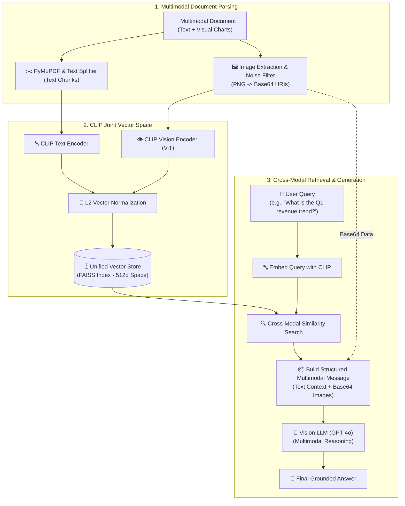

# Krish_naik_rag_notes

<details><summary>08_langchain_updated_version1.1 (LangChain v1.1 & LangGraph Agent Architecture)</summary>

# LangChain v1.1 & LangGraph Agent Architecture

This module contains modern, production-grade implementations of the **LangChain v1.1 / 1.x API** built on the **LangGraph** execution engine.

---

## 📚 Notebook Overview & Key Concepts

| Notebook | Topic & Core Focus | Key LangChain v1.1 APIs Used |
| :--- | :--- | :--- |
| **`1-langchainintro.ipynb`** | Agent Foundations & Tool Calling | `create_agent()`, `@tool`, `agent.invoke()` |
| **`2-modelintegration.ipynb`** | Universal Model Provider Loading | `init_chat_model()`, `ChatOpenAI()`, `ChatGroq()`, `ChatGoogleGenerativeAI()` |
| **`3-tools.ipynb`** | Tool Definition & Model Binding | `@tool`, `model.bind_tools()`, `ai_msg.tool_calls` |
| **`4-messages.ipynb`** | Canonical Message Schema | `SystemMessage`, `HumanMessage`, `AIMessage`, `ToolMessage` |
| **`5-structuredoutput.ipynb`** | Schema Enforcement | `with_structured_output()`, `response_format`, `Pydantic`, `TypedDict` |
| **`6-middleware.ipynb`** | Agent Middleware & Checkpoints | `SummarizationMiddleware`, `HumanInTheLoopMiddleware`, `InMemorySaver`, `Command` |

---

## 🛠️ Key Technical Highlights

### 1. High-Level Agent Instantiation (`create_agent`)
```python
from langchain.agents import create_agent
from langchain_core.tools import tool

@tool
def get_weather(city: str) -> str:
    """Get the weather for a city."""
    return f"The weather in {city} is sunny."

agent = create_agent(
    model="gpt-4o-mini",
    tools=[get_weather],
    system_prompt="You are a helpful assistant."
)

result = agent.invoke({"messages": [{"role": "user", "content": "What is the weather in New York?"}]})
```

### 2. Multi-Provider Universal Model Initializer (`init_chat_model`)
```python
from langchain.chat_models import init_chat_model

model_openai = init_chat_model("gpt-4o-mini")
model_groq = init_chat_model("groq:llama-3.3-70b-versatile")
model_gemini = init_chat_model("google_genai:gemini-1.5-flash")
```

### 3. Native Schema Enforcement
```python
from pydantic import BaseModel, Field
from typing_extensions import TypedDict, Annotated

class Movie(BaseModel):
    title: str = Field(description="The title of the movie")
    year: int = Field(description="The release year")

structured_model = model.with_structured_output(Movie)
```

### 4. Stateful Middleware & Human-in-the-Loop Operations
```python
from langchain.agents import create_agent
from langchain.agents.middleware import SummarizationMiddleware, HumanInTheLoopMiddleware
from langgraph.checkpoint.memory import InMemorySaver

agent = create_agent(
    model="gpt-4o-mini",
    checkpointer=InMemorySaver(),
    middleware=[
        SummarizationMiddleware(model="gpt-4o-mini", trigger=("messages", 10), keep=("messages", 4))
    ]
)
```

</details>

<details><summary>Rag</summary>


# Study Notes: Retrieval-Augmented Generation (RAG)

## Core Concept

**RAG (Retrieval-Augmented Generation)** is a technique that enhances AI language models by combining their text-generation capabilities with external knowledge retrieval.

* **The Analogy:**
* **Traditional LLM (Without RAG):** Like a student taking a *closed-book exam*. It can only answer based on the information it memorized during its initial training. If it doesn't know, it might guess (hallucinate) or say "I don't know."
* **RAG-Enabled AI:** Like a student taking an *open-book exam*. It can look up specific, current, or specialized information from a "library" (external databases) before generating its answer.


---

## The 3 Core Components of RAG

1. **[R]etrieval:** Finding relevant information. The system searches external sources (like a Vector Database) using similarity search to find data related to the user's query.
2. **[A]ugmentation:** Enhancing the context. The retrieved data is combined with metadata (e.g., source tags like *"Source: Tesla Annual Report 2023"*) and added to the user's original prompt.
3. **[G]eneration:** Producing the answer. The Large Language Model (LLM) reads the enriched context and generates a highly accurate, grounded response.

---

## RAG Architecture Workflow

The process is broken down into three distinct phases:

### Phase 1: Document Ingestion

* **Data Sources:** Raw data (PDFs, Web Pages, Databases) is collected.
* **Processing:** The data goes through a Document Splitter to break it into chunks.
* **Embedding:** An Embedding Model converts text into mathematical vectors (e.g., `[0.31, -0.22, 0.85...]`).
* **Storage:** These vectors are stored in a **Vector Database**.

### Phase 2: Query Processing

* The user submits a query (e.g., "What is RAG?").
* The query is converted into an embedding.
* The system performs a **Similarity Search** in the Vector Database to find the most relevant document chunks.

### Phase 3: Generation

* The relevant chunks are formatted as **Augmented Context**.
* This context is fed into a **Large Language Model** (like GPT-4, Claude, or Llama).
* The LLM synthesizes the information and outputs the **Generated Response**.

---

## Comparison: Traditional LLM vs. RAG (Customer Support Example)

| Feature | Traditional LLM (Without RAG) | AI Assistant (With RAG) |
| --- | --- | --- |
| **Data Source** | Training data only | LLM + Vector Database |
| **Response Type** | Generic, unhelpful, or outdated | Specific, actionable, and up-to-date |
| **Example Output** | *"Generally, most companies offer 30-day returns, but policies may vary..."* | *"According to our current policy (v3.2), Black Friday purchases have an extended 60-day window..."* |

---

## Real-World Benefits & Business Impact

* **Cost Savings:** Reduces the need for constant model retraining. *(Example: JPMorgan saved $150M annually by using RAG instead of fine-tuning models monthly).*
* **Accuracy (Reducing Hallucinations):** Grounds the AI in actual facts. *(Example: Microsoft reported a 94% reduction in AI hallucinations in their Copilot products).*
* **Flexibility & Real-Time Updates:** Can ingest live data instantly. *(Example: Bloomberg updates its financial AI assistant hourly with new market data, which is impossible with traditional LLMs).*
* **Compliance & Sourcing:** Allows the AI to provide citations. *(Example: Healthcare companies use RAG to ensure AI responses always cite approved medical sources).*

  [1-2RAG (1).pdf](https://github.com/user-attachments/files/29892069/1-2RAG.1.pdf)

 </details>


<details><summary>fine tunning vs rag </summary>


---

# AI Customization Methods: A Beginner's Guide

A comparison of the three primary ways to customize Large Language Models (LLMs): Prompt Engineering, Fine-tuning, and RAG.

## 1. Prompt Engineering

**Concept:** Teaching through instructions. The underlying AI model itself remains completely unchanged.

### 📊 Diagram Flow

```text
[User Prompt: "Act as an expert chef..."] 
                    ↓
        [Base LLM (Remains Unchanged)] 
                    ↓
          [Customized Output]

```

### 📝 Key Details

* **How it Works:**
* Write specific instructions in your prompt.
* Structure prompts with clear context.
* Use examples (few-shot learning).


* **Pros:**
* No technical expertise needed.
* Instant results.
* Free (no training costs).
* Highly flexible and works with any LLM.


* **Cons:**
* Strictly limited by the model's existing base knowledge.
* Can yield inconsistent results.
* Token limits restrict how complex you can make the prompt.
* Cannot add new, permanent knowledge to the model.


* **Best For:** Quick prototyping, small-scale applications, general-purpose tasks, and when you need maximum flexibility.

---

## 2. Fine-Tuning

**Concept:** Teaching through training. It alters the model's permanent weights to create a specialized version of the original AI.

### 📊 Diagram Flow

```text
[Base LLM (Original Weights)]  +  [Domain-Specific Training Data]
                               ↓
                            (Train)
                               ↓
        [Fine-Tuned LLM (Modified Weights / Specialized)]

```

### 📝 Key Details

* **How it Works:**
* Prepare domain-specific training data.
* Train the base model on your data.
* Model weights are permanently changed to create a specialized version.


* **Pros:**
* Creates deeply specialized knowledge and consistent behavior.
* Eliminates the need for complex prompt engineering.
* Can learn specific new writing styles.
* Significantly better for highly specific domains.


* **Cons:**
* Expensive to execute (can cost $1000s – $10000s).
* Requires Machine Learning (ML) expertise.
* Needs complete retraining for any informational updates.
* The model can sometimes "forget" general knowledge during training.


* **Best For:** Highly specific writing styles or tones, domain-specific language, high-volume/consistent tasks, and situations where accuracy is critical.

---

## 3. RAG (Retrieval-Augmented Generation)

**Concept:** Teaching through retrieval. It pulls in outside information in real-time to help the AI answer a query accurately.

### 📊 Diagram Flow

```text
[User Query] ─────────────> [Vector Database / Knowledge Base]
      ↓                                   ↓
      └─────────> [Retrieved Relevant Documents]
                                  ↓
                              [Base LLM]
                                  ↓
                        [Augmented Response]

```

### 📝 Key Details

* **How it Works:**
* Store company documents or data in a Vector Database.
* Retrieve relevant documents for each specific query.
* Combine the retrieved documents with the query to serve as context.
* The LLM generates an answer based strictly on that context.


* **Pros:**
* Always provides up-to-date information.
* Requires no model training (highly cost-effective).
* Can safely handle private or proprietary data.
* High accuracy with reduced hallucination.


* **Cons:**
* Requires initial infrastructure setup (like Vector DBs).
* The final result is heavily dependent on the quality of the retrieval step.
* Context window limitations still apply.
* Adds latency (delay) to the response time due to the retrieval step.


* **Best For:** Knowledge bases and documentation, real-time or frequently updated info, customer support systems, and compliance-heavy industries.

  [5-Promptvsfinetunignvsrag.pdf](https://github.com/user-attachments/files/29892064/5-Promptvsfinetunignvsrag.pdf)

  </details>


<details><summary>Vector store / vector databases</summary>

# Study Notes: Vector Stores vs. Vector Databases

## The Golden Rule

Start with a **Vector Store** for prototyping and learning. Graduate to a **Vector Database** when you need production-scale features, reliability, and advanced querying capabilities.

---

## 1. Vector Stores

A lightweight library or tool focused on storing and searching vectors efficiently.

### Key Characteristics

* **Core Function:** Simple similarity search (finding the K nearest neighbors to a query vector).
* **Architecture:** Usually runs in-memory or as a local file (single-machine operation).
* **Scale:** Handles smaller datasets (< 1 million vectors).
* **Speed:** Extremely fast query speed (Microseconds).
* **Setup & Cost:** Quick to set up (Minutes), typically deployed locally, and usually free.

### When to Use

* Building a proof of concept (POC).
* Working with less than 1 million vectors.
* You need the absolute fastest possible search speed.
* You have a limited budget or want full control over the implementation.
* Building embedded applications.

### Popular Examples

* FAISS
* Annoy
* ChromaDB
* ScaNN
* NMSLIB

---

## 2. Vector Databases

A full-featured database system designed for managing and querying vector data at scale.

### Key Characteristics

* **Core Function:** Advanced search (filters, metadata queries) and full database operations (CRUD: Create, Read, Update, Delete).
* **Architecture:** Distributed system with replication, sharding, and high availability.
* **Scale:** Built for massive datasets (Billions+ of vectors).
* **Speed:** Slightly slower query speed due to overhead (Milliseconds).
* **Setup & Cost:** Takes longer to set up (Hours/Days), usually cloud-deployed, and incurs costs ($$$).

### When to Use

* Building production and enterprise applications.
* Need to scale beyond millions of vectors.
* Require high availability and system reliability.
* Need advanced filtering and metadata search alongside vector search.
* Have multiple users/tenants accessing the data.
* Want managed infrastructure rather than handling it locally.

### Popular Examples

* Pinecone
* Weaviate
* Qdrant
* Milvus
* Vespa
* DataStax

---

## 3. Quick Reference Comparison

| Feature | Vector Store | Vector Database |
| --- | --- | --- |
| **Scale** | ~1 Million vectors | Billions+ vectors |
| **Setup Time** | Minutes | Hours/Days |
| **Query Speed** | Microseconds | Milliseconds |
| **Features** | Basic Search | Full CRUD & Metadata filtering |
| **Deployment** | Local | Cloud |
| **Cost** | Free | Paid ($$$) |
[23-+Vector+store+vs+Vector+Databases.pdf](https://github.com/user-attachments/files/29892056/23-%2BVector%2Bstore%2Bvs%2BVector%2BDatabases.pdf)

</details>


Semantic Chunking is a text-splitting technique that divides content based on meaning instead of fixed size or paragraphs.
<details><summary>sementic chunking </summary>
  
**Semantic Chunking**:

## Overview

**Semantic Chunking** is the process of splitting a document into meaningful units (chunks) based on **semantic similarity** rather than fixed criteria like token count or line numbers.

In Retrieval-Augmented Generation (RAG) systems, semantic chunking improves performance through the pipeline:

$$\text{Better chunks} \rightarrow \text{Better retrieval} \rightarrow \text{Better grounding} \rightarrow \text{Better answers}$$

Chunks generated via this method are designed to be **self-contained, contextually rich, and logically separated**.

---

## How It Works (Step-by-Step)

1. **Document Segmentation:** The document is split into smaller units, such as individual sentences or paragraphs.
2. **Sentence Embedding:** Each sentence/unit is converted into a vector representation using an embedding model.
3. **Semantic Similarity Check:** The similarity (e.g., Cosine Similarity) between adjacent sentence embeddings is calculated and compared against a defined threshold (e.g., $0.80$).
4. **Sentence Merging:** Adjacent sentences are merged into a single chunk if their similarity score meets or exceeds the threshold.
5. **Form Chunks:** The process outputs grouped chunks containing semantically related sentences, while distinct sentences are separated into standalone chunks.

---

## Example

Given the input text:

1. *"LangChain is a framework for building LLM-powered apps."*
2. *"It integrates with tools like OpenAI and Pinecone."*
3. *"The Eiffel Tower is located in Paris."*
4. *"France is a popular tourist destination."*

**Output Chunks:**

* **Chunk 1:** `["LangChain is a framework...", "It integrates with tools..."]` *(Merged because both discuss LangChain/LLMs)*
* **Chunk 2:** `["The Eiffel Tower is located in Paris."]`
* **Chunk 3:** `["France is a popular tourist destination."]`

  [33-Semantic+Chunking.pdf](https://github.com/user-attachments/files/29892074/33-Semantic%2BChunking.pdf)
</details>


<details><summary>Dense+Sparse retrival</summary>


## Hybrid Search Strategies: Dense & Sparse Retrieval

**Hybrid Retrieval** combines both dense and sparse scoring methods (e.g., using a weighted sum or learning-to-rank methods) to improve search recall and relevance. By combining these, you get the "best of both worlds": the semantic, context-aware power of vector embeddings and the precise, exact-match capabilities of keywords.

---

### 1. Sparse Retrieval (Exact Keyword Search)

Sparse retrieval focuses on finding exact word matches between the query and the documents.

* **How it works:** It converts text into a sparse matrix representing word occurrences.
* **Techniques used:** Bag-of-Words (BoW), TF-IDF, and BM25.
* **Best for:** Exact keyword searches (e.g., searching for a specific name, ID, or unique term).

### 2. Dense Retrieval (Semantic Search)

Dense retrieval focuses on the underlying *meaning* and context of the query rather than just exact word matches.

* **How it works:** It uses Vector Embeddings to map text into a high-dimensional vector space. It finds matches by calculating the similarity between the query vector and document vectors.
* **Techniques used:** Cosine Similarity.
* **Common Tools:** Vector databases like FAISS and ChromaDB.
* **Best for:** Semantic meaning (e.g., knowing that "building apps" and "developing software" mean similar things).

---

### The Hybrid Search Formula

Hybrid search calculates a final score by combining the dense and sparse scores using a specific weightage ($\alpha$).

**The Equation:**


**Where:**

* $\text{Score}_{\text{dense}}$ is calculated using Cosine Similarity between the input and the vector store.
* $\text{Score}_{\text{sparse}}$ is calculated using techniques like TF-IDF.
* $\alpha$ is the weightage (often set to $0.5$ for an equal balance).

---

### Practical Example

**Documents in Database:**

* **D1:** "LangChain helps build LLM apps"
* **D2:** "Pinecone is used for vector search"
* **D3:** "Eiffel Tower is in Paris"

**User Query:** "build application using LLM"
**Weightage ($\alpha$):** 0.5

*(Assuming hypothetical individual scores for demonstration)*

* **D1 Calculation:**
* Dense Score = 0.85, Sparse Score = 0.60
* $\text{D1 Score} = (0.5 \times 0.85) + (0.5 \times 0.60) = 0.725$


* **D2 Calculation:**
* Dense Score = 0.40, Sparse Score = 0.20
* $\text{D2 Score} = (0.5 \times 0.40) + (0.5 \times 0.20) = 0.30$


* **D3 Calculation:**
* Dense Score = 0.10, Sparse Score = 0.10
* $\text{D3 Score} = (0.5 \times 0.10) + (0.5 \times 0.10) = 0.10$


**Result:** D1 has the highest hybrid score, making it the most relevant document returned for the query.
</details>


You can find the documentation in the [Text Representation tech. Repo](https://github.com/Shivanshvyas1729/pydantic_notes/blob/main/nlp/Text%20Representation%20tech.md).

<details><summary>Reranking </summary>
## Study Notes: Hybrid Search Strategies & Re-Ranking Techniques


### 1. Overview of Re-Ranking

* **Definition:** Re-ranking is a **second-stage filtering process** used in retrieval systems, particularly within Retrieval-Augmented Generation (RAG) pipelines.
* **Core Objective:** To refine and re-order an initial set of retrieved document chunks so that the most relevant contextual evidence appears at the top before being sent to the LLM.

---

### 2. RAG Pipeline Stages & Architecture

The workflow is divided into three distinct stages:

1. **Stage 1: Retrieval (Fast, Broad Retrieval)**
* **Exact Match Retrieval:** Uses algorithms like **BM25** to find literal keyword matches.
* **Semantic Search:** Uses vector store embeddings (e.g., **FAISS**) to match documents by semantic similarity.
* **Hybrid Search:** Combines results from both exact keyword search and vector similarity search to produce an initial `top-k` set of candidate chunks.


2. **Stage 2: Re-Ranking (Accurate, Deep Re-Scoring)**
* Takes the `top-k` candidates from Stage 1.
* Uses a slower but significantly more accurate model—such as a **Cross-Encoder** or an **LLM**—to evaluate the full query-document pair.
* Re-scores and reorders the chunks to select only the highest-quality relevant context.


3. **Stage 3: Generation**
* Feeds the user prompt alongside the top re-ranked relevant chunks into the LLM to generate the final response.


---

### 3. Why Use Re-Rankers in a RAG Pipeline?

| Factor / Strategy | Without Re-Ranker | With Re-Ranker |
| --- | --- | --- |
| **1. Relevance of Context** | `Top-k` documents may only be loosely or partially related. | `Top-k` documents are re-scored and reordered for maximum relevance. |
| **2. Factual Accuracy** | LLMs are prone to hallucinations if low-quality context is retrieved. | Irrelevant documents are filtered out, resulting in grounded, factual answers. |
| **3. Handling Ambiguity** | First-stage retrievers lack a deep understanding of complex query intent. | Evaluates full query-doc pairs for significantly better intent alignment. |
| **4. Semantic Matching** | Dense retrievers can miss relevant documents that have low vector similarity scores. | Leverages deeper models (cross-encoders/LLMs) to capture subtle semantic connections. |
| **5. Keyword vs. Meaning** | Keyword models (like BM25) may favor exact string matches even if contextually unhelpful. | Effectively balances lexical (keyword) and semantic (meaning) relevance. |
| **6. Evidence Prioritization** | All retrieved documents are treated with equal importance. | The highest-quality evidence is dynamically floated to the top. |
| **7. Long-Tail Queries** | Weak retrievers struggle to locate matches for rare or niche queries. | Better captures rare, long-tail, but highly meaningful matches. |
| **8. LLM Efficiency** | Irrelevant context causes LLMs to yield verbose, unfocused, or incorrect output. | High-precision context improves generation speed, conciseness, and accuracy. |
| **9. Noise Reduction** | Unrelated content (e.g., ads, boilerplate text) can slip into the prompt. | Pushes noisy content to the bottom or filters it out entirely. |
| **10. Flexible Scoring** | Constrained to fixed retriever scoring rules. | Allows custom scoring strategies incorporating metadata, recency, or user preferences. |

---

### 4. Summary Takeaway

> **First-stage retrievers** prioritize **speed** over precision to fetch candidate chunks from large databases. **Second-stage re-rankers** trade speed for **accuracy** by evaluating candidate chunks through a deeper neural network, ensuring the LLM context window receives only clean, prioritized, and highly factual information.


</details>

<details><summary>MMR (Maximal Marginal Relevance )</summary>


# Hybrid Search Strategies: Maximal Marginal Relevance (MMR)

## What is MMR?

**Maximal Marginal Relevance (MMR)** is a powerful, diversity-aware retrieval technique used primarily in information retrieval and Retrieval-Augmented Generation (RAG) pipelines.

**Aim:** Its primary goal is to balance **relevance** and **novelty**. It prevents the retriever from returning highly similar documents that repeat the same content. MMR ensures selected documents are both:

1. Relevant to the user's query.
2. Diverse from one another (non-redundant).

---

## The MMR Formula

The algorithm evaluates a candidate document's relevance against the query while penalizing it for similarity to documents that have already been selected.

$$\text{MMR}(d) = \lambda \cdot \text{sim}(d, q) - (1 - \lambda) \cdot \max_{s \in S} \text{sim}(d, s)$$

### Key Parameters:

* $q$: The user query.
* $d$: A candidate document from the document set $D$.
* $S$: The set of documents that have *already* been selected.
* $\text{sim}(a, b)$: The similarity function being used (e.g., Cosine Similarity).
* $\lambda$ (Lambda): A tunable parameter between $0$ and $1$.
* A higher $\lambda$ prioritizes **relevance** to the query.
* A lower $\lambda$ prioritizes **diversity** among documents.


---

## Step-by-Step Example

Imagine we have three candidate documents (D1, D2, D3) and we want to select the top 2 documents using MMR.

**1. Initial Query Relevance (Cosine Similarity)**

* $\text{sim}(D1, Q) = 0.95$
* $\text{sim}(D2, Q) = 0.93$
* $\text{sim}(D3, Q) = 0.80$

**Step 1:** We pick **D1** first because it has the highest raw similarity score (0.95).

**2. Calculating Diversity (Similarity to Selected Doc D1)**

* $\text{sim}(D1, D2) = 0.90$ (Highly redundant)
* $\text{sim}(D1, D3) = 0.30$ (Highly diverse)

**Step 2:** Select the second document using the MMR formula. Let's assume $\lambda = 0.7$.

* **For D2:**

$$\text{MMR}(D2) = (0.7 \cdot 0.93) - (0.3 \cdot 0.90) = 0.651 - 0.270 = \mathbf{0.381}$$


* **For D3:**

$$\text{MMR}(D3) = (0.7 \cdot 0.80) - (0.3 \cdot 0.30) = 0.560 - 0.090 = \mathbf{0.470}$$


**Result:** Even though D2 is more relevant to the query than D3 ($0.93$ vs $0.80$), **D3** is selected as the second document.

* **Final Rank:** 1. D1 | 2. D3
* **Reason:** D3 provides the best balance of diversity and relevance, whereas D2 was too redundant with the information already present in D1.

---

## When to Use vs. When Not to Use MMR

| Scenario | Details / Reasoning |
| --- | --- |
| **When to Use MMR** |  |
| **RAG Pipelines** | Avoids feeding Large Language Models (LLMs) redundant documents, leading to richer, more useful context. |
| **Chatbots & Search Apps** | Great for FAQs, document browsers, and applications where a broad coverage of an answer is needed. |
| **Hybrid Retrieval** | Works well when combining Dense + Sparse search strategies. |
| **When NOT to Use MMR** |  |
| **Extremely Short Context** | If you only have room for (or only want) the single top-1 most relevant document. |
| **Precision Only** | When you are strictly focused on accuracy and do not care about topic coverage. |
| **Pre-existing Diversity** | If the source documents are already inherently diverse. |
| **LLM Reranking** | If redundancy is already being handled downstream by an LLM post-filter or reranker. |
</details>


<details><summary>Query Expansion Technique </summary>

 **Query Expansion Technique** 


## 📌 Overview: Query Enhancement

In a Retrieval-Augmented Generation (**RAG**) pipeline, the quality of the user query directly dictates the context retrieved, which in turn determines the accuracy of the LLM's final response.

> **Query Enhancement / Expansion** is the technique of refining, reformulating, or expanding an initial user query before sending it to the retriever to ensure higher-quality context retrieval.

---

## 🎯 When to Use Query Expansion

* **Short/Under-specified Queries:** When the initial prompt lacks context or depth.
* **Ambiguous Prompts:** When keywords have multiple potential interpretations.
* **Broader Scope:** To capture synonyms, related domain concepts, and common spelling variants.

---

## 🔄 Query Expansion Examples

| Original Query | Enhanced Query |
| --- | --- |
| `"LangChain memory"` | `"LangChain memory modules, conversation memory"` |
| `"tools in LLM"` | `"LangChain tools, APIs, calculator, agent tools"` |
| `"retrieval"` | `"vector retrieval, dense search, BM25, MMR"` |

---

## ⚡ The Chain Reaction

$$\text{Better Query} \longrightarrow \text{Better Retrieved Chunks} \longrightarrow \text{Better Grounded LLM Answers}$$

---

## 🏗️ Query Expansion Workflow / Architecture

1. **Input Query:** The raw user input is received.
2. **Query Enhancement Step:** An internal LLM with a specific prompt (or chain execution) expands/refines the original query into an enhanced version.
3. **Retriever:** The enhanced query is sent to the **Vector Store** / Retriever (e.g., using **FAISS** or **Hybrid Search**).
4. **Top-K Documents:** The retriever returns the initial top $k$ relevant chunks.
5. **Re-Ranker:** Re-ranks the retrieved top $k$ documents to ensure the most relevant context is prioritized.
6. **Final LLM Output:** The ordered context is passed to the LLM to generate the final output.
7.
8. 
</details>


<details><summary>Query Decomposition</summary>
  
 **Query Decomposition** 

---

## 📌 Query Enhancement: Query Decomposition

### 1. What is Query Decomposition?

**Query Decomposition** is the technique of taking a complex, multi-part user question and breaking it down into simpler, atomic sub-questions that can be retrieved and answered individually.

---

### 2. Why Use Query Decomposition?

* **Handles Multi-Concept Queries:** Complex user requests often combine multiple topics that a single retrieval step might miss.
* **Improves Retrieval Accuracy:** LLMs or standard retrievers can overlook parts of a long or dense prompt.
* **Enables Multi-Hop Reasoning:** Allows answering complex questions step-by-step.
* **Supports Parallel Processing:** Sub-questions can be processed in parallel across multiple retrievers or agents (especially within multi-agent frameworks).

---

### 3. How It Works (Workflow Breakdown)

1. **User Query Input:** A complex query is received (e.g., *"What memory modules does LangChain support and how are they different from CrewAI Agents?"*).
2. **Decomposition Layer:**
* Uses **LLM + Prompting** or **Regex / Rule-based Operations** to split the main query into smaller sub-queries:
* **Sub-Query 1:** *What memory modules does LangChain support?*
* **Sub-Query 2:** *What memory modules/agents does CrewAI support?*
* **Sub-Query 3:** *LangChain memory vs. CrewAI agents.*


3. **Retrieval & LLM Calls (Parallel/Sequential):**
* Each sub-query goes to a **Retriever** to gather relevant context (**Top-K Context**).
* Each context + prompt is passed to an **LLM** to generate sub-answers ($O_1, O_2, O_3$).


4. **Answer Synthesis:**
* An **Answer Combiner / Synthesizer** merges $O_1, O_2,$ and $O_3$ into a single, cohesive **Final Answer**.


---

### 4. Major Disadvantage ⚠️

* **Increased Latency & Cost:** Performing multiple retrieval steps and several LLM calls per user request significantly increases processing time and API token usage.
  
  
</details>


<details><summary>HyDE Technique</summary>
**Hypothetical Document Embeddings (HyDE)** :

---

# Study Notes: Hypothetical Document Embeddings (HyDE)

## 1. What is HyDE?

**HyDE (Hypothetical Document Embeddings)** is an advanced retrieval-augmented generation (RAG) technique. Instead of embedding a user's raw query directly into a vector space, HyDE uses an LLM to first generate a **hypothetical answer (document)**, and then embeds that generated document to search the vector database.

* **Core Goal:** Bridge the semantic gap between how users ask questions and how information is phrased in source documents.

---

## 2. When to Use HyDE

HyDE is especially useful when:

* **Short Queries:** The user's input lacks rich context or detail.
* **Language/Phrasing Mismatch:** The vocabulary in the question differs significantly from the phrasing in the target documents.
* **Answer-Centric Retrieval:** You need to retrieve content based on what an **answer** looks like rather than matching question keywords.

---

## 3. How HyDE Works (Workflow)

```text
[ User Query ] ──► [ LLM ] ──► [ Hypothetical Answer ] ──► [ Embedding Model ]
                                                                   │
[ Final Output ] ◄── [ LLM ] ◄── [ Top-K Docs ] ◄── [ Vector Retriever ]

```

1. **Query Input:** User provides a query.
2. **Hypothetical Generation:** An LLM generates a plausible (hypothetical) response to the query.
3. **Vector Embedding:** The hypothetical response is converted into a vector embedding.
4. **Retrieval:** The vector database retrieves the **Top-K** actual documents matching the hypothetical embedding.
5. **RAG Completion:** The retrieved ground-truth documents are passed to the LLM to form the final accurate answer.

---

## 4. Problem vs. Solution & Key Benefits

| Feature / Problem | How HyDE Helps |
| --- | --- |
| **Vocabulary Mismatch** | Embeds answer-style structure rather than search keywords. |
| **Vague Queries** | LLM-generated hypothetical content adds rich semantic context. |
| **Target Representation** | Models what a relevant document is likely to look like. |
| **Zero-Shot Retrieval** | Delivers strong retrieval performance without task-specific retraining. |
| **Plug-and-Play** | Easy to integrate with existing providers (e.g., OpenAI, Cohere, Hugging Face). |


</details>

<details><summary>Multimodal AI</summary>


# Section 1: Core PDF & Lecture Notes

## 1. Key Concepts & Overview

* **Multimodal RAG:** Integrates both text and visual data into a unified retrieval-augmented pipeline so queries can reference both modalities.
* **Supported Source Data:** PDFs, Word documents, and Databases.
* **Multimodal LLM Engine:** Uses vision-capable models (e.g., OpenAI `GPT-4.1`, Google `Gemini 2.5 Flash`) to process combined text and image context to generate final responses.

---

## 2. Core Processing Steps & Pipeline Flow

```
[ PDF / Word / Database ] ➔ [ Extract Text & Images ] ➔ [ CLIP Embeddings ] ➔ [ FAISS Vector Store ]
                                                                                      │
[ Multimodal Answer ] ◄── [ Multimodal LLM ] ◄── [ Format Payload ] ◄── [ Top-K Retrieval ] ◄── [ Query ]
```

1. **Data Extraction:** Raw input documents (PDFs, Word files, databases) are parsed to decouple text content from embedded image files.
2. **CLIP Embedding:**
   * **Model:** OpenAI **CLIP** (*Contrastive Language-Image Pre-Training*).
   * **Components:** Combines a **Text Transformer** and a **Vision Transformer (ViT)**.
   * **Vectorization:** Converts both text chunks and images into vector embeddings in a shared space.
3. **Vector Storage:** Embeddings are indexed in a vector store (**FAISS**) for rapid similarity search.
4. **Query & Retrieval:**
   * Incoming user queries are embedded using CLIP.
   * A vector search retrieves the **Top-$K$ relevant documents** containing mixed text and image data.
5. **Formatting & LLM Generation:**
   * Retrieved text and images are formatted into a structured payload.
   * Sent to the Multimodal LLM (e.g., GPT-4.1 or Gemini Flash 2.5) to produce a grounded multimodal answer.

---

## 3. Ingesting Non-Digital & Physical Media

* **Digitization:** Physical photos or paper pages must be digitized first (via high-resolution scanning or photo capture). Digitization quality directly impacts model accuracy.
* **Embedding Processing:** Digitized images pass through CLIP visual embedding to convert visual elements into vector representations.
* **Retrieval Compatibility:** The vector storage and retrieval pipeline must be configured to process digitized images alongside text end-to-end.

---

<details><summary>More Detail</summary>

---

# Section 2: Extended & Advanced Multimodal RAG Concepts

## 1. Architectural Paradigms: Classic vs. Visual-Native

### Approach A: Classic Parsing Pipeline

1. **Extraction:** Layout tools split documents into raw text and cropped figures.
2. **Single-Vector Indexing:** Images are either captioned by a VLM or embedded using CLIP into a single vector per chunk.
3. **Trade-offs:** Fast at scale, but susceptible to OCR loss and destroys spatial formatting (e.g., tables, charts, complex slide decks).

### Approach B: Visual-Native & OCR-Free Pipeline (ColPali)

* **Concept:** Bypasses text/image extraction entirely by treating every PDF page directly as a single high-resolution image object.
* **Patch-Level Tokenization:** Pages are split into a grid of visual patches (e.g., ~1024 patches per page) using visual encoders (e.g., ColPali, ColQwen2.5).
* **Late-Interaction Scoring (MaxSim):**
  Calculates similarity by finding the maximum cosine similarity between each query token vector $q \in Q$ and document patch vector $d \in D$:

  $$\text{Score}(Q, D) = \sum_{q \in Q} \max_{d \in D} \left( q \cdot d^\top \right)$$

* **Advantages:** High precision for scanned documents, CAD drawings, financial charts, and complex page layouts without requiring OCR.

---

## 2. Modern Embedding Models & Document Parsers

| Category | Key Models & Tools | Primary Use Case |
| :--- | :--- | :--- |
| **Unified Single-Vector Models** | Cohere Embed 4, Voyage Multimodal 3.5, SigLIP 2 | Embeds interleaved text and page images into single vector indexes. |
| **Multi-Vector / Late-Interaction** | ColPali-3, ColQwen2.5-7B, ColSmolVLM | Preserves visual layout and fine-grained patch details for MaxSim search. |
| **Advanced Layout Parsers** | Docling (IBM), LlamaParse, Marker/Surya OCR, MinerU | Converts non-standard PDFs into layout-aware Markdown and structured tables. |

---

## 3. System Architecture Diagrams

### A. Classic Parse & CLIP-Based Pipeline

```
                       [ INPUT DATA ]
                    (PDF, Word, Database)
                              │
                              ▼
                   [ Document Parser ]
                 (Extract & Decouple)
                              │
               ┌──────────────┴──────────────┐
               ▼                             ▼
        [ Text Chunks ]              [ Image Chunks ]
      (Paragraphs, Tables)         (Figures, Diagrams)
               │                             │
               ▼                             ▼
       [ Text Transformer ]         [ Vision Transformer (ViT) ]
        (CLIP Text Encoder)           (CLIP Vision Encoder)
               │                             │
               └──────────────┬──────────────┘
                              ▼
                  [ Shared Embedding Space ]
                              │
                              ▼
                  [ Vector Store (FAISS) ]
                    (Dense Vector Index)
                              │
 ┌─────────────── Query ──────┤
 │                            ▼
 │                   [ Vector Search ]
 │                (Fetch Top-K Context)
 │                            │
 │                            ▼
 │                 [ Multimodal Prompt ]
 │             (Formatted Text + Image Objects)
 │                            │
 └────────────────────────────┼────────────────────────┐
                              ▼                        ▼
                   [ Multimodal LLM (VLM) ]  (User Query Prompt)
                (GPT-4.1 / Gemini 2.5 Flash)
                              │
                              ▼
                  [ Grounded Multimodal Answer ]
```

### B. Visual-Native (OCR-Free / ColPali & Late Interaction)

```
                      [ PDF Page Render ]
                    (High Resolution Image)
                               │
                               ▼
                   [ Vision-Language Encoder ]
                (ColPali / ColQwen2.5 / ColSmol)
                               │
                               ▼
                   [ Patch-Level Tokenization ]
                     (Grid of ~1024 Patches)
                               │
                               ▼
                   [ Multi-Vector Indexing ]
                  (Per-Patch Vector Embeddings)
                               │
[ User Query ]                 │
      │                        │
      ▼                        │
[ Query Encoder ]              │
 (Token Vectors)               │
      │                        │
      └───────────┬────────────┘
                  ▼
       [ Late-Interaction Engine ]
   MaxSim(Q, D) = Σ max (q_i · d_j^T)
                  │
                  ▼
       [ Top-K Retracted Pages ]
                  │
                  ▼
       [ Vision LLM Generation ]
     (Reads Layout, Charts & Text)
```

### C. Enterprise Hybrid Search Architecture

```
                                    ┌──────────────────────┐
                                    │  Ingested Document   │
                                    └──────────┬───────────┘
                                               │
               ┌───────────────────────────────┼───────────────────────────────┐
               ▼                               ▼                               ▼
      [ Layout Parser ]               [ Text Chunker ]               [ Page Rendering ]
     (Docling / Surya)               (Paragraph Splits)               (300 DPI Images)
               │                               │                               │
               ▼                               ▼                               ▼
       [ Sparse Tokens ]               [ Dense Vectors ]              [ Multi-Vectors ]
        (BM25 Inverted)                (Cohere / Voyage)              (ColPali / MaxSim)
               │                               │                               │
               ▼                               ▼                               ▼
      ┌─────────────────┐             ┌─────────────────┐             ┌─────────────────┐
      │  BM25 Index     │             │  Text Vector    │             │ Visual Patch    │
      │  (Exact Match)  │             │  Index (k-NN)   │             │ Index (MaxSim)  │
      └────────┬────────┘             └────────┬────────┘             └────────┬────────┘
               │                               │                               │
               └───────────────────────┬───────┴───────────────────────────────┘
                                       ▼
                       [ Reciprocal Rank Fusion (RRF) ]
                       (Hybrid Search Reranker Stage)
                                       │
                                       ▼
                         [ Multimodal Context Payload ]
                           • Extracted Text & Tables
                           • Page Visual Renderings
                           • Spatial Bounding Boxes
                                       │
                                       ▼
                       [ Vision-Language Generator ]
                      (Gemini 2.5 Pro / GPT-4.1 / Claude)
                                       │
                                       ▼
                        [ Multimodal Citation Output ]
```

</details>
</details>


<details><summary>Multimodal RAG & Multimodal AI Architecture</summary>

# Multimodal RAG & Multimodal AI

## 1. What is Multimodal RAG?

**Multimodal RAG (Retrieval-Augmented Generation)** extends standard text-only RAG by processing, indexing, retrieving, and reasoning over multiple data modalities—such as **text**, **images**, **charts**, **tables**, and **diagrams**.

* **Core Goal:** Overcome text-only limitations by combining **Joint Embedding Spaces** (e.g., CLIP) with **Vision LLMs** (e.g., GPT-4o) to handle visual knowledge inside complex documents.

---

## 2. Key Architecture Components

1. **Dual Modal Parsing:** Text is chunked via character splitters while visual elements (charts/diagrams) are extracted with image quality filters.
2. **Joint Embedding Space (CLIP):** Both text passages and image pixels are mapped into the exact same 512-dimensional vector space using OpenAI CLIP.
3. **Cross-Modal Similarity Search:** Text queries (e.g., *"Show Q1 revenue chart"*) directly match image vectors in the FAISS vector database.
4. **Structured Vision Prompting:** Retrieved text excerpts and base64-encoded visual images are passed to **GPT-4o** for multi-modal reasoning.

---

## 3. Multimodal AI Workflow Diagram



---

## 4. Key Benefits

| Feature | Standard RAG | Multimodal RAG |
| --- | --- | --- |
| **Data Modality** | Text Chunks Only | Text + Images + Charts + Diagrams |
| **Vector Space** | Text Embedding Models | CLIP Shared Vector Space (Text & Image) |
| **Retrieval Type** | Text-to-Text | Cross-Modal (Text-to-Image & Text-to-Text) |
| **Reasoning Model** | Text LLM (GPT-3.5/4) | Vision LLM (GPT-4o / GPT-4 Vision) |


</details>


<details><summary>      AI Agents vs. Agentic AI      </summary>


## Key Definitions

* **AI Agents:** Individual, task-specific software programs designed to carry out dedicated tasks autonomously with minimal to no human intervention.
* **Agentic AI:** A broader system framework where multiple AI agents collaborate, adapt, and make complex decisions independently to achieve large-scale goals.

---

## Core Differences

| Feature | AI Agents | Agentic AI |
| --- | --- | --- |
| **Scope & Architecture** | Single entity focused on a specific task. | Network of collaborating agents working across complex workflows. |
| **Functionality & Autonomy** | Handles predefined tasks with limited autonomy. | Focuses on overall system optimization with high flexibility. |
| **Decision-Making** | Relies on predefined rules and rigid boundaries. | Makes autonomous decisions based on real-time data and circumstances. |
| **Adaptability** | Operates strictly within given parameters. | Continuous learning, reasoning, and adapting over time from experience. |

---

## Core Operational Loop of Agentic AI

1. **Perception:** Gathers and processes data from the surrounding environment.
2. **Reasoning:** Analyzes the context to understand current events and goals.
3. **Action:** Executes specific targeted actions based on conclusions.
4. **Learning:** Evaluates feedback and improves system performance over time.

---

## Technical Components (Architecture)

* **Brain / Reasoning Engine:** Large Language Models (LLMs) that process instructions, plan steps, and drive decisions.
* **Tools & Execution:** External tools and APIs used to perform actions (e.g., search tools, software integration).
* **Databases & Memory:** Historical context and data storage for recall and continuous learning.

---

## Practical Examples

### AI Agents

* **Customer Service Chatbots:** Handles standard queries or balance inquiries within set script parameters.
* **Automated Banking Bots:** Performs specific transactions following clearly defined, rigid procedures.

### Agentic AI

* **Smart Home Systems:** Networks multiple devices (lights, thermostat, appliances) to optimize power usage, security, and climate based on real-time habits.
* **Personalized Health Assistants:** Analyzes complete patient medical history, real-time vital metrics, and lifestyle factors while updating recommendations as new medical research emerges.
</details>


<details><summary>   example why we need agentic ai  ( Software Development Workflow & Agentic AI Systems)  </summary>
--


## 1. Traditional Agile Software Development Workflow

* **Projects (e.g., XYZ Company):**
1. **Requirement Gathering:** Handled by Business Analysts and Product Managers.
2. **Sprint Planning:** Execution using the Agile process framework.
3. **Developer Teams:** Manual implementation and task assignment across human developers.


---

## 2. Agentic AI System Overview

* **Core Concept:** Integrating Large Language Models (LLMs) and autonomous AI Agents into software development to automate tasks from requirement breakdown to code generation and testing.
* **Key Components:**
* **Requirements Processing:** Inputs (business requirements) are processed by an LLM-driven system to generate structured tasks.
* **Task Decomposition:** High-level requirements are split into discrete sub-tasks:
* **Task 1** $\rightarrow$ **Dev 1 Agent**
* **Task 2** $\rightarrow$ **Dev 2 Agent**
* **Task 3** $\rightarrow$ **Dev 3 Agent**


---

## 3. Agentic Workflow Execution & Features

* **AI Developers (Dev 1, Dev 2, Dev 3):** Autonomous AI agents executing code implementation based on assigned sub-tasks.
* **Automated Quality Assurance & Engineering:**
* **Code Review:** Autonomous evaluation of generated code quality and standards.
* **Testing & Bug Reporting:** Automated test execution with feedback loops to raise bugs.
* **Prompt Engineering:** Refinement of system prompts to optimize code output quality.


* **Human Intervention & Feedback (Human-in-the-Loop):**
* Human oversight is integrated into critical decision points to maintain high **accuracy** and ensure compliance with business requirements.


* **Use Cases / Applications Mentioned:**
* Coding projects
* Blog generation systems
</details>
