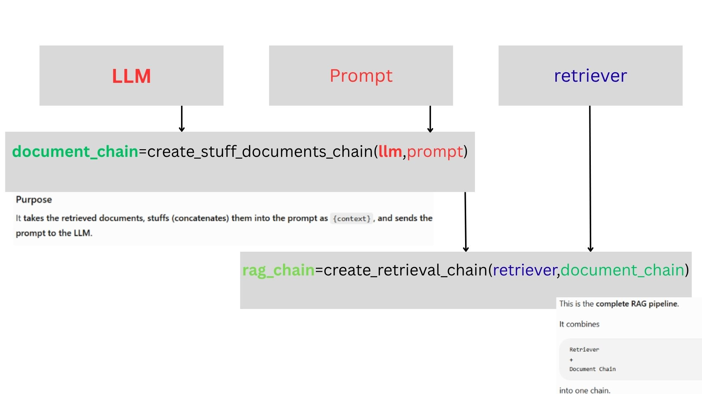

# RAG (Retrieval-Augmented Generation) Comprehensive Notes (1-13)

---

## 📋 Table of Contents
1. [Data Ingestion & Splitting](#1-data-ingestion--splitting-1-dataingestionipynb)
2. [PDF Parsing](#2-pdf-parsing-2-dataparsingpdfipynb)
3. [Word Document Parsing](#3-word-document-parsing-3-dataparsingdocipynb)
4. [CSV & Excel Structured Parsing](#4-csv--excel-structured-parsing-4-csvexcelparsingipynb)
5. [JSON Parsing](#5-json-parsing-5-jsonparsingipynb)
6. [Database Parsing](#6-database-parsing-6-databaseparsingipynb)
7. [Embedding Models](#7-embedding-models-70-embeddingipynb--71-openaiembeddingsipynb)
8. [Vector Databases](#8-vector-databases-81---84)
   * [ChromaDB (`langchain_chroma.Chroma`)](#1-chroma-langchain_chromachroma)
   * [FAISS (`langchain_community.vectorstores.FAISS`)](#2-faiss-langchain_communityvectorstoresfaiss)
   * [Pinecone (`langchain_pinecone.PineconeVectorStore`)](#3-pinecone-langchain_pineconepineconevectorstore)
   * [InMemoryVectorStore](#4-inmemoryvectorstore-langchain_corevectorstoresinmemoryvectorstore)
   * [Vector Distance Metrics & Similarity Scores](#understanding-vector-distance-metrics--similarity-scores)
9. [RAG Chains & Conversational Memory](#9-rag-chains--conversational-memory-81-chromadbipynb)
10. [Semantic Chunking](#10-semantic-chunking-91-semantichunkingipynb)
    * [RAG Chain Types Comparison](#rag-chain-types-comparison)
    * [Vector Store vs Vector Database](#vector-store-vs-vector-database)
11. [Hybrid Search & Re-ranking](#11-hybrid-search--re-ranking-05_hybrid-search)
    * [11.1 Hybrid Retriever – Dense & Sparse Combination](#111-hybrid-retriever--dense--sparse-combination-1-densesparseipynb)
    * [11.2 Re-ranking Hybrid Search Strategies](#112-re-ranking-hybrid-search-strategies-2-reranking-1ipynb)
    * [11.3 Maximal Marginal Relevance - MMR](#113-maximal-marginal-relevance---mmr-3-mmripynb)
12. [Query Enhancement & Advanced RAG](#12-query-enhancement--advanced-rag-06_query_enhancment)
    * [12.1 Query Expansion](#121-query-expansion-1-queryexpansionipynb)
    * [12.2 Query Decomposition](#122-query-decomposition-2-querydecompositionipynb)
    * [12.3 Hypothetical Document Embeddings (HyDE)](#123-hypothetical-document-embeddings---hyde-3-hydeipynb)
13. [Multimodal RAG](#13-multimodal-rag-07_multimodle-rag)

---

## 1. Data Ingestion & Splitting (`1-dataingestion.ipynb`)
### Imports
```python
from langchain_core.documents import Document
from langchain_text_splitters import RecursiveCharacterTextSplitter, CharacterTextSplitter, TokenTextSplitter
from langchain_community.document_loaders import TextLoader, DirectoryLoader
```
### How to Use
```python
# 🔹 LOAD: Load plain text file from disk into Document objects
loader = TextLoader("data/sample.txt")
documents = loader.load()

# 🔹 SPLIT: Split documents recursively using sentence & paragraph boundaries
text_splitter = RecursiveCharacterTextSplitter(chunk_size=500, chunk_overlap=50)
chunks = text_splitter.split_documents(documents)
```
### What They Do
*   `Document`: LangChain's base data structure holding `page_content` (text chunk) and `metadata` dictionary.
*   `RecursiveCharacterTextSplitter`: **Best default splitter**. Recursively splits on `\n\n`, `\n`, `" "` to preserve paragraph structure.
*   `CharacterTextSplitter`: Rigidly splits on a single specified character.
*   `TokenTextSplitter`: Splits text by exact LLM token count using `tiktoken`.
*   `TextLoader` / `DirectoryLoader`: Loads single files or entire folders into LangChain Document instances.
*   📌 **Key Concept**: **Chunk overlap (50-100 tokens)** is critical to prevent loss of context across split boundaries.

---

## 2. PDF Parsing (`2-dataparsingpdf.ipynb`)
### Imports
```python
from langchain_community.document_loaders import PyPDFLoader, PyMuPDFLoader
```
### How to Use
```python
# 🔹 LOAD PDF: PyMuPDF provides fast C-based layout extraction page-by-page
loader = PyMuPDFLoader("data/sample.pdf")
pages = loader.load()
```
### What They Do
*   `<mark style="background-color: #e2e3e5; color: #383d41; padding: 2px 5px; border-radius: 4px;">PyPDFLoader</mark>`: Pure Python PDF loader, extracts simple text page-by-page.
*   `<mark style="background-color: #d4edda; color: #155724; padding: 2px 5px; border-radius: 4px;">PyMuPDFLoader</mark>`: <mark style="background-color: #d4edda; color: #155724; padding: 2px 4px; border-radius: 4px;">Extremely fast C-based engine</mark>. Handles multi-column layouts, images, and fonts far better.
*   📌 **Key Concept**: <mark style="background-color: #fff3cd; color: #856404; padding: 2px 4px; border-radius: 4px;">Clean ligature errors (`fi`, `fl`)</mark> and extra newline spaces after loading PDF raw text.

---

## 3. Word Document Parsing (`3-dataparsingdoc.ipynb`)
### Imports
```python
from langchain_community.document_loaders import Docx2txtLoader, UnstructuredWordDocumentLoader
from unstructured.partition.docx import partition_docx
```
### How to Use
```python
# 🔹 FAST PLAIN TEXT: Quick extraction for simple .docx files
loader = Docx2txtLoader("data/sample.docx")
docs = loader.load()

# 🔹 STRUCTURED ELEMENTS: Extract titles, narrative text & tables separately
unstructured_loader = UnstructuredWordDocumentLoader("data/sample.docx", mode="elements", strategy="fast")
element_docs = unstructured_loader.load()
```
### What They Do
*   `<mark style="background-color: #e2e3e5; color: #383d41; padding: 2px 5px; border-radius: 4px;">Docx2txtLoader</mark>`: Lightweight plain-text `.docx` loader.
*   `<mark style="background-color: #d1ecf1; color: #0c5460; padding: 2px 5px; border-radius: 4px;">UnstructuredWordDocumentLoader</mark>`: Partitions Word files into discrete element objects (Titles, Paragraphs, Tables).
*   📌 **Key Concept**: Use `Docx2txtLoader` for speed, and `Unstructured` (`mode="elements"`) when filtering headers/footers by category metadata.

---

## 4. CSV & Excel Structured Parsing (`4-csvexcelparsing.ipynb`)
### Imports
```python
from langchain_community.document_loaders import CSVLoader, UnstructuredExcelLoader
import pandas as pd
```
### How to Use
```python
# 🔹 ROW-BY-ROW LOAD: Each row becomes a Document with key-value pairs
loader = CSVLoader("data/products.csv", source_column="Product")
docs = loader.load()
```
### What They Do
*   `<mark style="background-color: #e2e3e5; color: #383d41; padding: 2px 5px; border-radius: 4px;">CSVLoader</mark>`: Converts each CSV row into a structured key-value text document.
*   `<mark style="background-color: #e2e3e5; color: #383d41; padding: 2px 5px; border-radius: 4px;">UnstructuredExcelLoader</mark>`: Extracts Excel sheet tables as text documents.
*   📌 **Key Concept**: <mark style="background-color: #f8d7da; color: #721c24; padding: 2px 4px; border-radius: 4px;">Avoid embedding raw tabular rows directly</mark>. Convert rows into natural language summaries (e.g. *"Product X costs $Y in Category Z"*) before embedding.

---

## 5. JSON Parsing (`5-jsonparsing.ipynb`)
### Imports
```python
from langchain_community.document_loaders import JSONLoader
```
### How to Use
```python
# 🔹 JQ FILTER: Extract specific nested fields using jq JSON query path
loader = JSONLoader("data/company.json", jq_schema=".employees[].role", text_content=True)
docs = loader.load()
```
### What They Do
*   `<mark style="background-color: #d1ecf1; color: #0c5460; padding: 2px 5px; border-radius: 4px;">JSONLoader</mark>`: Parses JSON/JSONL using `jq_schema` expressions to select target attributes.
*   📌 **Key Concept**: Strip syntax brackets (`{}[]"`) and convert nested JSON values into descriptive natural text strings prior to vector indexing.

---

## 6. Database Parsing (`6-databaseparsing.ipynb`)
### Imports
```python
from langchain_community.utilities import SQLDatabase
from langchain_community.document_loaders import SQLDatabaseLoader
```
### How to Use
```python
# 🔹 CONNECT & QUERY: Run SQL query and load row outputs into Document objects
db = SQLDatabase.from_uri("sqlite:///data/company.db")
loader = SQLDatabaseLoader(query="SELECT name, role FROM employees", db=db)
docs = loader.load()
```
### What They Do
*   `<mark style="background-color: #e2e3e5; color: #383d41; padding: 2px 5px; border-radius: 4px;">SQLDatabase</mark>`: Manages DB connections and fetches table DDL schemas.
*   `<mark style="background-color: #e2e3e5; color: #383d41; padding: 2px 5px; border-radius: 4px;">SQLDatabaseLoader</mark>`: Converts SQL query record outputs to LangChain Document chunks.
*   📌 **Key Concept**: <mark style="background-color: #f8d7da; color: #721c24; padding: 2px 4px; border-radius: 4px;">Do NOT embed entire relational tables</mark>. Use Text-to-SQL agent workflows with **Read-Only** database permissions.

---

## 7. Embedding Models (`7.0-embedding.ipynb` & `7.1-openaiembeddings.ipynb`)
### Imports
```python
from langchain_huggingface import HuggingFaceEmbeddings
from langchain_openai import OpenAIEmbeddings
```
### How to Use
```python
# 🔹 LOCAL EMBEDDINGS ($0 cost): Runs open-source HuggingFace model locally
hf_embeddings = HuggingFaceEmbeddings(model_name="all-MiniLM-L6-v2")
vector_query = hf_embeddings.embed_query("your query text")

# 🔹 API EMBEDDINGS: Calls OpenAI API for text-embedding-3-small vectors
openai_embeddings = OpenAIEmbeddings(model="text-embedding-3-small")
vector_docs = openai_embeddings.embed_documents(["doc chunk 1", "doc chunk 2"])
```
### What They Do
*   `<mark style="background-color: #d4edda; color: #155724; padding: 2px 5px; border-radius: 4px;">HuggingFaceEmbeddings</mark>`: <mark style="background-color: #fff3cd; color: #856404; padding: 2px 4px; border-radius: 4px;">$0 local embedding generation</mark> using open-source models (`all-MiniLM-L6-v2`).
*   `<mark style="background-color: #d1ecf1; color: #0c5460; padding: 2px 5px; border-radius: 4px;">OpenAIEmbeddings</mark>`: High-dimensional semantic vectors via OpenAI API (`text-embedding-3-small`).
*   **Key Methods**:
    *   `embed_documents(list_of_texts)`: <mark style="background-color: #e2e3e5; color: #383d41; padding: 2px 4px; border-radius: 4px;">Indexing phase</mark> (processes batch of text chunks).
    *   `embed_query(single_text)`: <mark style="background-color: #e2e3e5; color: #383d41; padding: 2px 4px; border-radius: 4px;">Search phase</mark> (processes user prompt).
*   📌 **Key Concept**: <mark style="background-color: #fff3cd; color: #856404; padding: 2px 4px; border-radius: 4px;">Cosine similarity measures angle</mark> between normalized vectors, eliminating document length bias.

---

## 8. Vector Databases (`8.1` - `8.4`)

### Overview & Comparison
Vector databases store and index high-dimensional vector embeddings generated by machine learning models to perform fast nearest-neighbor similarity searches (like Cosine Similarity or Euclidean L2 Distance).

| Vector DB | Type | Storage / Persistence | Key Advantage | Best Use Case |
|-----------|------|-----------------------|---------------|---------------|
| **ChromaDB** | **Open Source / Local & Cloud** | Disk (SQLite/Parquet) or Cloud Server / Hosted Cloud | **Zero-config local setup**, persistence, client/server & managed cloud support | **Local RAG & rapid prototyping**, microservices via Chroma Cloud |
| **FAISS** | **In-Memory C++ Library** | Local Files (`.index` / `.pkl`) | **Blazing fast GPU/CPU vector search** | **In-memory batch vector searches**, localized search without server overhead |
| **Pinecone** | **Cloud Managed Service** | Fully Managed Serverless Cloud | **Zero infra management**, enterprise scaling & real-time updates | **Production RAG pipelines**, multi-tenant SaaS applications |
| **AstraDB / DataStax** | **Cloud Managed Service** | Serverless Cassandra | **Vector + NoSQL JSON docs**, global scale & low latency | **Enterprise hybrid data RAG** requiring document storage |
| **InMemoryVectorStore** | **Core Store** | In-Memory Python Dict | **Zero external dependencies**, pure Python execution | **Unit testing & CI/CD**, single-session demo scripts |

---

### 💡 When to Use Which Vector Database? (Decision Guide)

1. **Use `ChromaDB` when:**
   * You are building **local RAG applications**, Python scripts, or desktop tools.
   * You want an easy, lightweight database that runs embedded in Python or in Docker containers.
   * You plan to transition from local testing to a remote microservice or managed **Chroma Cloud** (`HttpClient` / Hosted Service) without changing your application query logic.

2. **Use `FAISS` when:**
   * You need **maximum similarity search speed** over fixed/static vector datasets.
   * You want to run searches purely in memory or perform high-throughput **GPU-accelerated** indexing.
   * You do **not** need multi-user concurrency, API server features, or real-time CRUD operations.

3. **Use `Pinecone` when:**
   * You are deploying **production RAG applications** to cloud environments.
   * You require a **fully managed serverless infrastructure** with automatic scaling, backup, high availability, and metadata filtering.
   * You want zero infrastructure maintenance (no managing servers or disk storage).

4. **Use `DataStax / AstraDB` when:**
   * You require enterprise-grade serverless cloud vector search backed by Apache Cassandra.
   * You need both **rich JSON document/NoSQL storage** alongside vector embeddings.

5. **Use `InMemoryVectorStore` when:**
   * You are running **unit tests**, continuous integration (CI) tests, or quick 1-file proof-of-concepts where vectors don't need to persist after Python exits.

---

### 1. Chroma (`langchain_chroma.Chroma`)
Chroma is an open-source, developer-friendly vector database. It can run in 3 deployment modes:
* 🟢 **Embedded Mode**: Runs inside your Python process and persists data to disk via SQLite/Parquet (ideal for local development).
* 🟡 **Client/Server Mode**: Runs Chroma as a standalone Docker container or separate service (`HttpClient`).
* 🔵 **Chroma Cloud**: Chroma offers a fully managed separate cloud service (`chromadb.CloudClient`), allowing hosted serverless deployment without managing local infrastructure.

#### Imports
```python
from langchain_chroma import Chroma
from langchain_openai import OpenAIEmbeddings
```

#### Complete Implementation (Create, Persist, Load & Query)
```python
import os
from langchain_chroma import Chroma
from langchain_openai import OpenAIEmbeddings

class ChromaVectorStoreManager:
    def __init__(self, persitent_dir="./chroma_db"):
        self.persitent_dir = persitent_dir
        self.embedding = OpenAIEmbeddings(model="text-embedding-3-small") # 🔹 KEY: Standardize embedding model across index & query

    def create_and_persist_vector_store(self, chunks):
        """
        Creates a Chroma vector store from document chunks and saves it locally to disk.
        """
        # 🔹 KEY OPERATOR: from_documents() builds index + generates vectors on disk
        db = Chroma.from_documents(
            chunks,
            self.embedding,
            persist_directory=self.persitent_dir
        )
        
        # 🔹 PERSISTENCE: Save SQLite + Vector index state locally
        db.persist()
        return db

    def load_vector_store(self):
        """
        Loads an existing persisted Chroma vector store from the local directory.
        """
        # 🔹 RE-INDEX / LOAD: Load existing local vector collection without re-embedding
        return Chroma(
            persist_directory=self.persitent_dir,
            embedding_function=self.embedding
        )

# ⚡ FAST EXECUTION FLOW:
# 1. Create store  -> manager.create_and_persist_vector_store(chunks)
# 2. Reload store  -> loaded_db = manager.load_vector_store()
# 3. Vector search -> loaded_db.similarity_search("What is RAG?", k=3)
```


#### Core Methods Breakdown
*   `Chroma.from_documents(chunks, self.embedding, persist_directory=self.persitent_dir)`: Embeds document chunks and saves indexed vectors into the specified persistent disk directory.
*   `db.persist()`: Forces writing/flushing any remaining vectors and metadata to disk storage.
*   `Chroma(persist_directory=self.persitent_dir, embedding_function=self.embedding)`: Re-instantiates and loads the saved vector store from disk without re-embedding text chunks.
*   `db.similarity_search(query, k=3)`: Retrieves top-k relevant document chunks based on vector closeness.

#### Metadata Pre-filtering & CRUD Operations
```python
# 1. Metadata Pre-Filtering Search
# Filters search results to only documents matching specific metadata criteria before similarity ranking
filtered_docs = db.similarity_search(
    "What is deep learning?",
    k=3,
    filter={"source": "data/sample.pdf", "page": 1}
)

# 2. Collection Inspection & Item Count
print(f"Total stored vectors: {db._collection.count()}")

```python
# 🔹 DELETE: Remove specific document entries from Chroma using unique IDs
db.delete(ids=["doc_id_1", "doc_id_2"])
```

---

### 2. FAISS (`langchain_community.vectorstores.FAISS`)
FAISS (Facebook AI Similarity Search) is a <mark style="background-color: #d4edda; color: #155724; padding: 2px 5px; border-radius: 4px;">high-performance C++ vector library</mark> designed for ultra-fast dense vector similarity search and GPU indexing.

#### Imports
```python
from langchain_community.vectorstores import FAISS
from langchain_openai import OpenAIEmbeddings
```

#### Complete Implementation (Create, Persist & Load)
```python
class FAISSVectorStoreManager:
    def __init__(self, persitent_dir="faiss_index"):
        self.persitent_dir = persitent_dir
        self.embedding = OpenAIEmbeddings(model="text-embedding-3-small")

    def create_and_persist_vector_store(self, chunks):
        """
        Creates a FAISS vector index in memory and saves index files (.faiss + .pkl) to disk.
        """
        # 🔹 BUILD FAISS INDEX: Creates in-memory C++ index from document vectors
        db = FAISS.from_documents(
            chunks,
            self.embedding
        )
        
        # 🔹 SAVE TO DISK: Writes binary index (.faiss) and metadata pickle (.pkl) files
        db.save_local(folder_path=self.persitent_dir)
        return db

    def load_vector_store(self):
        """
        Loads a saved FAISS index from the local directory.
        """
        # 🔹 DESERIALIZE INDEX: Load local FAISS binary index into RAM
        return FAISS.load_local(
            folder_path=self.persitent_dir,
            embeddings=self.embedding,
            allow_dangerous_deserialization=True  # ⚠️ ALLOW UNPICKLE: Required for metadata docstore
        )
```

#### Core Methods Breakdown
*   `FAISS.from_documents(chunks, embedding)`: <mark style="background-color: #e2e3e5; color: #383d41; padding: 2px 4px; border-radius: 4px;">Constructs in-memory FAISS similarity index</mark>.
*   `db.save_local(folder_path)`: <mark style="background-color: #fff3cd; color: #856404; padding: 2px 4px; border-radius: 4px;">Serializes binary index files (`index.faiss` & `index.pkl`)</mark>.
*   `FAISS.load_local(...)`: <mark style="background-color: #d1ecf1; color: #0c5460; padding: 2px 4px; border-radius: 4px;">Loads index back into RAM memory</mark>.

---

### 3. Pinecone (`langchain_pinecone.PineconeVectorStore`)
Pinecone is a <mark style="background-color: #f8d7da; color: #721c24; padding: 2px 5px; border-radius: 4px;">cloud-native, fully-managed serverless vector database</mark> built for zero-maintenance enterprise scaling and real-time metadata filtering.

#### Imports
```python
from langchain_pinecone import PineconeVectorStore
from pinecone import Pinecone, ServerlessSpec
from langchain_openai import OpenAIEmbeddings
```

#### Complete Implementation (Create & Load)
```python
import os
from pinecone import Pinecone, ServerlessSpec
from langchain_pinecone import PineconeVectorStore
from langchain_openai import OpenAIEmbeddings

class PineconeVectorStoreManager:
    def __init__(self, index_name="rag-index"):
        self.index_name = index_name
        self.embedding = OpenAIEmbeddings(model="text-embedding-3-small")
        self.pc = Pinecone(api_key=os.getenv("PINECONE_API_KEY")) # 🔹 AUTH: Initialize Pinecone client with API key

    def create_and_persist_vector_store(self, chunks):
        """
        Creates index if missing and embeds chunks directly into cloud Pinecone index.
        """
        existing_indexes = [idx["name"] for idx in self.pc.list_indexes()]
        if self.index_name not in existing_indexes:
            # 🔹 CREATE CLOUD INDEX: Initialize serverless index specification on AWS/GCP
            self.pc.create_index(
                name=self.index_name,
                dimension=1536,  # 🔹 VECTOR DIMENSION: Must match text-embedding-3-small (1536)
                metric="cosine",
                spec=ServerlessSpec(cloud="aws", region="us-east-1")
            )
            
        # 🔹 UPSERT VECTORS: Embed chunks & stream vectors directly to Pinecone Cloud
        db = PineconeVectorStore.from_documents(
            chunks,
            self.embedding,
            index_name=self.index_name
        )
        return db

    def load_vector_store(self):
        """
        Connects to an existing cloud-hosted Pinecone vector store index.
        """
        # 🔹 CONNECT TO CLOUD INDEX: Instant pointer connection without downloading vectors
        return PineconeVectorStore(
            index_name=self.index_name,
            embedding=self.embedding
        )
```

---

### 4. InMemoryVectorStore (`langchain_core.vectorstores.InMemoryVectorStore`)
Simplest zero-dependency <mark style="background-color: #fff3cd; color: #856404; padding: 2px 5px; border-radius: 4px;">transient in-memory vector store</mark> built directly into `langchain-core`. Vectors are stored in a Python dictionary and lost when process terminates.

```python
from langchain_core.vectorstores import InMemoryVectorStore
from langchain_openai import OpenAIEmbeddings

# 🔹 INITIALIZE IN-MEMORY STORE: Pure Python dictionary storage
embedding = OpenAIEmbeddings()
db = InMemoryVectorStore.from_documents(chunks, embedding)

# 🔹 QUERY: Perform exact distance search in RAM
results = db.similarity_search("Explain vector embeddings", k=2)
```

---

### Understanding Vector Distance Metrics & Similarity Scores

Similarity search relies on mathematical distance metrics between high-dimensional vector embeddings:

1. 📐 **Cosine Similarity**:
   * Measures the <mark style="background-color: #d1ecf1; color: #0c5460; padding: 2px 4px; border-radius: 4px;">angle cosine between two vectors</mark>.
   * **Range**: `-1.0` to `1.0` (or normalized `0.0` to `1.0`).
   * 📌 **Interpretation**: **<mark style="background-color: #d4edda; color: #155724; padding: 2px 4px; border-radius: 4px;">Higher is MORE similar</mark>**. `1.0` represents identical vector direction regardless of text length.

2. 📏 **Euclidean Distance (L2 Distance)**:
   * Measures <mark style="background-color: #e2e3e5; color: #383d41; padding: 2px 4px; border-radius: 4px;">straight-line geometric distance</mark> between vector points in multi-dimensional space.
   * **Range**: `0.0` to `+∞`.
   * 📌 **Interpretation**: **<mark style="background-color: #fff3cd; color: #856404; padding: 2px 4px; border-radius: 4px;">Lower is MORE similar</mark>**. `0.0` represents identical vector positions.

3. 🎯 **Dot Product (Inner Product)**:
   * Measures both vector angle and magnitude. Fast for normalized vectors where dot product equals cosine similarity.

> ⚠️ **Important Note on Score Sorting**:
> * `db.similarity_search(query)` returns Documents ordered by relevance.
> * `db.similarity_search_with_score(query)` returns tuples `(Document, score)`. When using L2 distance metrics (e.g., Chroma default), **<mark style="background-color: #fff3cd; color: #856404; padding: 2px 4px; border-radius: 4px;">smaller scores represent closer matches</mark>**. When using cosine similarity, **<mark style="background-color: #d4edda; color: #155724; padding: 2px 4px; border-radius: 4px;">larger scores represent closer matches</mark>**.

---

## 9. RAG Chains & Conversational Memory (`8.1-chromadb.ipynb`)


### Imports
```python
# LLM Initialization
from langchain_openai import ChatOpenAI
from langchain.chat_models.base import init_chat_model

# Prompts & Message Structure
from langchain_core.prompts import ChatPromptTemplate, MessagesPlaceholder
from langchain_core.messages import HumanMessage, AIMessage

# Output Parsers & Runnables (LCEL)
from langchain_core.output_parsers import StrOutputParser
from langchain_core.runnables import RunnablePassthrough, RunnableParallel

# Chains & Retrievers (Built-in - langchain_classic for LangChain 1.x compatibility)
from langchain_classic.chains import create_retrieval_chain, create_history_aware_retriever
from langchain_classic.chains.combine_documents import create_stuff_documents_chain
```

### How to Use

#### 1. LLM / Model Initialization Methods

**Method A: Using LangChain's Factory Function**
```python
# Uses environment variables (OPENAI_API_KEY, OPENAI_BASE_URL) automatically
llm = init_chat_model("openai:gpt-4.1-mini") 
```

**Method B: Making a Model Using Native Client (OpenAI API directly)**
If you want to bypass LangChain and interact with the LLM directly using a client:
```python
from openai import OpenAI

# Initialize the client
client = OpenAI(
    api_key="your_api_key",
    base_url="https://api.euron.one/api/v1/euri" # Optional: for custom providers
)

# Make a model request using the client
response = client.chat.completions.create(
    model="gpt-4.1-mini",
    messages=[{"role": "user", "content": "What is Deep Learning?"}]
)
print(response.choices[0].message.content)
```

#### 2. Custom RAG Chain using LCEL (LangChain Expression Language)
LCEL provides a declarative way to construct chains using the pipe operator (`|`).

```python
# Initialize LLM
llm = init_chat_model("openai:gpt-4.1-mini") 

# Define a custom prompt template
custom_prompt = ChatPromptTemplate.from_template("""Use the following context to answer the question. 
If you don't know the answer based on the context, say you don't know.
Provide specific details from the context to support your answer.

Context:
{context}
                                                 
Question: {question}

Answer: """)

# Setup retriever
retriever = vectorstore.as_retriever(search_kwargs={"k": 3})

# Helper function to format retrieved documents
def format_docs(docs):
    return "\n\n".join(doc.page_content for doc in docs)

# Build the custom RAG Chain using LCEL
rag_chain_lcel = (
    {
        "context": retriever | format_docs, 
        "question": RunnablePassthrough()
    }
    | custom_prompt
    | llm
    | StrOutputParser()
)

# Test/Invoke the chain
response = rag_chain_lcel.invoke("What is Deep Learning")

# Query function using the LCEL approach
def query_rag_lcel(question):
    print(f"Question: {question}")
    print("-" * 50)
    
    # Pass string query directly to the chain
    answer = rag_chain_lcel.invoke(question)
    print(f"Answer: {answer}")
    
    # Get source documents separately for inspection
    docs = retriever.invoke(question)
    print("\nSource Documents:")
    for i, doc in enumerate(docs):
        print(f"\n--- Source {i+1} ---")
        print(doc.page_content[:200] + "...")

# Run verification
query_rag_lcel("What are the key concepts in reinforcement learning?")
```

#### 3. Conversational RAG Chain (With History/Memory)
'''  (compare to Modern RAG Chain below only 2 things are different 1. the history-aware retriever and 2. the chat history placeholder in the prompt)'''

To support multi-turn conversation and resolve pronouns (e.g. "what are its uses?"), we use a history-aware retriever.

```python
# 1. Create a prompt for reformulating the question
contextualize_q_system_prompt = """Given a chat history and the latest user question 
which might reference context in the chat history, formulate a standalone question 
which can be understood without the chat history. Do NOT answer the question, 
just reformulate it if needed and otherwise return it as is."""

contextualize_q_prompt = ChatPromptTemplate.from_messages([
    ("system", contextualize_q_system_prompt),
    MessagesPlaceholder("chat_history"),
    ("human", "{input}"),
])

# 2. Create the history-aware retriever
history_aware_retriever = create_history_aware_retriever(
    llm, retriever, contextualize_q_prompt
)

# 3. Create a document chain with history
qa_system_prompt = """You are an assistant for question-answering tasks. 
Use the following pieces of retrieved context to answer the question. 
If you don't know the answer, just say that you don't know. 
Use three sentences maximum and keep the answer concise.

Context: {context}"""

qa_prompt = ChatPromptTemplate.from_messages([
    ("system", qa_system_prompt),
    MessagesPlaceholder("chat_history"),
    ("human", "{input}"),
])

question_answer_chain = create_stuff_documents_chain(llm, qa_prompt)

# 4. Create conversational RAG chain
conversational_rag_chain = create_retrieval_chain(
    history_aware_retriever, 
    question_answer_chain
)

# 5. Invoke conversational RAG chain
chat_history = []

# First question
result1 = conversational_rag_chain.invoke({
    "chat_history": chat_history,
    "input": "What is machine learning?"
})
print(f"Q: What is machine learning?")
print(f"A: {result1['answer']}")

# Update history
chat_history.extend([
    HumanMessage(content="What is machine learning"),
    AIMessage(content=result1['answer'])
])

# Follow-up question (refers to ML from previous question)
result2 = conversational_rag_chain.invoke({
    "chat_history": chat_history,
    "input": "What are its main types?"
})
print(f"Q: What are its main types?")
print(f"A: {result2['answer']}")
```

#### 4. Modern RAG Chain (Using LangChain Classic Retrieval Chain)

The classic RAG chain uses helper functions like `create_stuff_documents_chain` and `create_retrieval_chain` to quickly stitch together a retriever, prompt, and LLM.

```python
import os
from langchain_openai import OpenAIEmbeddings
from langchain_chroma import Chroma
from langchain_classic.chains import create_retrieval_chain
from langchain_core.prompts import ChatPromptTemplate
from langchain_classic.chains.combine_documents import create_stuff_documents_chain

# Configure Environment (Euron API compatibility)
os.environ["OPENAI_API_KEY"] = os.getenv("EURI_API_KEY")
os.environ["OPENAI_BASE_URL"] = "https://api.euron.one/api/v1/euri"

sample_text = "Machine Learning is fascinating"
embeddings = OpenAIEmbeddings()

persist_directory = "./chroma_db"

# Create a ChromaDB vector store
vectorstore = Chroma.from_documents(
    documents=chunks,
    embedding=embeddings,
    persist_directory=persist_directory,
    collection_name="rag_collection"
)

print(f"Vector store named : {vectorstore._collection.name} ")
print(f"Vector store created with {vectorstore._collection.count()} vectors")
print(f"Persisted to: {persist_directory}")

# Setup retriever
retriever = vectorstore.as_retriever(
    search_kwargs={"k": 3}
)

# Setup prompt template
system_prompt = """You are an assistant for question-answering tasks. 
Use the following pieces of retrieved context to answer the question. 
If you don't know the answer, just say that you don't know. 
Use three sentences maximum and keep the answer concise.

Context: {context}"""

prompt = ChatPromptTemplate.from_messages([
    ("system", system_prompt),
    ("human", "{input}")
])

# Create stuff documents chain & retrieval chain
document_chain = create_stuff_documents_chain(llm, prompt)
rag_chain = create_retrieval_chain(retriever, document_chain)

# Invoke the RAG chain
response = rag_chain.invoke({"input": "What is Deep Learning"})
```

### What They Do
*   `ChatOpenAI` / `init_chat_model`: Direct instantiation vs a configurable factory helper to initialize chat models.
*   `ChatPromptTemplate`: Creates structured message prompts for the LLM.
*   `StrOutputParser`: Extracts the string content from the LLM's response message object.
*   `RunnablePassthrough`: Passes the input unmodified through the current step (useful for mapping user queries).
*   `create_stuff_documents_chain`: Combines a list of documents into a single prompt template context window.
*   `create_retrieval_chain`: Chains a retriever and stuff-documents chain together.
*   `create_history_aware_retriever`: Combines conversation history and user query, asking the LLM to draft a standalone query *before* searching the Vector DB. Ensures correct pronoun resolution (e.g. "it", "them").

---

## 10. Semantic Chunking (`9.1-semantichunking.ipynb`)

### Imports
```python
# Pure Python / SentenceTransformers implementation
from sentence_transformers import SentenceTransformer
from sklearn.metrics.pairwise import cosine_similarity
import numpy as np

# LangChain & RAG Pipeline Integration
from langchain_experimental.text_splitter import SemanticChunker
from langchain_community.document_loaders import TextLoader
from langchain_openai import OpenAIEmbeddings
from langchain_core.documents import Document
from langchain_community.vectorstores import FAISS
from langchain.chat_models import init_chat_model
from langchain_core.runnables import RunnableMap
from langchain_core.prompts import PromptTemplate
from langchain_core.output_parsers import StrOutputParser
```

### How to Use

#### Method A: Custom Threshold-Based Semantic Chunker (Pure Python / SentenceTransformers)
```python
class ThresholdSemanticChunker:
    def __init__(self, model_name="all-MiniLM-L6-v2", threshold=0.7):
        self.model = SentenceTransformer(model_name)
        self.threshold = threshold 

    def split(self, text: str):
        # 1. Split text into sentences
        sentences = [s.strip() for s in text.split('.') if s.strip()]
        if not sentences:
            return []
        
        # 2. Compute embeddings for all sentences
        embeddings = self.model.encode(sentences)
        chunks = []
        current_chunk = [sentences[0]]

        # 3. Calculate cosine similarity between consecutive adjacent sentences
        for i in range(1, len(sentences)):
            sim = cosine_similarity([embeddings[i - 1]], [embeddings[i]])[0][0]
            if sim >= self.threshold:
                current_chunk.append(sentences[i])
            else:
                chunks.append(". ".join(current_chunk) + ".")
                current_chunk = [sentences[i]]

        chunks.append(". ".join(current_chunk) + ".")
        return chunks

    def split_documents(self, docs):
        result = []
        for doc in docs:
            for chunk in self.split(doc.page_content):
                result.append(Document(page_content=chunk, metadata=doc.metadata))
        return result

# Usage
chunker = ThresholdSemanticChunker(threshold=0.7)
chunks = chunker.split_documents([Document(page_content="...")])
```

#### Method B: Built-in LangChain `SemanticChunker`
```python
# 1. Load Document
loader = TextLoader("langchain_intro.txt")
docs = loader.load()

# 2. Initialize embedding model (e.g., OpenAI or local HuggingFace)
embeddings = OpenAIEmbeddings()

# 3. Initialize Semantic Chunker (default breakpoint threshold type: percentile)
chunker = SemanticChunker(
    embeddings, 
    breakpoint_threshold_type="percentile" # Options: 'percentile', 'standard_deviation', 'interquartile', 'gradient'
)

# 4. Split documents into semantically coherent chunks
semantic_chunks = chunker.split_documents(docs)
```

#### Method C: Modular RAG Pipeline with Semantic Chunker & FAISS
```python
# 1. Custom semantic chunking
chunker = ThresholdSemanticChunker(threshold=0.7)
chunks = chunker.split_documents(docs)

# 2. Store in FAISS Vector Store
embeddings = OpenAIEmbeddings()
vectorstore = FAISS.from_documents(chunks, embeddings)
retriever = vectorstore.as_retriever()

# 3. Prompt & LLM Setup
prompt = PromptTemplate.from_template(
    "Answer the question based on the following context:\n\n{context}\n\nQuestion: {question}\n"
)
llm = init_chat_model(model="groq:gemma2-9b-it", temperature=0.4)

# 4. Build LCEL Chain
rag_chain = (
    RunnableMap({
        "context": lambda x: retriever.invoke(x["question"]),
        "question": lambda x: x["question"],
    })
    | prompt
    | llm
    | StrOutputParser()
)

# 5. Run Query
result = rag_chain.invoke({"question": "What is LangChain used for?"})
print(result)
```

### What They Do
*   `SemanticChunker`: Splits documents dynamically based on sentence embedding similarity rather than arbitrary length-based character limits.
*   `cosine_similarity`: Measures cosine similarity between consecutive sentence vectors. If similarity falls below `threshold`, a topic shift is detected and a chunk boundary is placed.
*   `breakpoint_threshold_type`: Strategy used by LangChain to calculate split thresholds:
    *   `percentile` (default): Splits when sentence distance exceeds a specified percentile cutoff across the document.
    *   `standard_deviation`: Splits based on standard deviation distance from the mean similarity score.
    *   `interquartile`: Uses interquartile range (IQR) to detect statistical anomalies/topic shifts.
    *   `gradient`: Looks for peaks in cosine distance gradients across sentences.

### 💡 Interview & Learning Notes

#### **Key Interview Questions:**
1. **Why use Semantic Chunking instead of `RecursiveCharacterTextSplitter`?**
   * Fixed-size chunkers (like character/token splitters) often cut text in the middle of a paragraph or thought, separating pronouns from their subjects.
   * Semantic chunking calculates similarity between adjacent sentences and only splits when similarity drops below a threshold (signaling a topic change). This preserves semantic context and leads to higher RAG retrieval quality.

2. **What is the main downside of Semantic Chunking?**
   * **Cost & Time**: Requires running an embedding model on *every single sentence* during the ingestion phase before final chunks are created. Using commercial API embeddings (e.g., OpenAI) for chunking can be expensive and slow.

#### **Learning Takeaways:**
* Use a fast, free local embedding model (e.g., `all-MiniLM-L6-v2`) for the sentence-level chunking pass, and save API embeddings (e.g., OpenAI) for indexing into the final vector database.

### 🚀 Best Practices for Semantic Chunking

1. **Cost & Token Optimization**:
   * Never use expensive API models (`text-embedding-3-large`) inside `SemanticChunker`. Use a fast local model (`HuggingFaceEmbeddings` / `SentenceTransformer`) for chunking logic, and use OpenAI embeddings only during final `vectorstore` indexing.

2. **Speed & Scalability**:
   * Semantic chunking is computationally heavy. For massive datasets (millions of documents), use standard `RecursiveCharacterTextSplitter` unless context fragmentation is demonstrably degrading answer quality.

3. **Threshold Tuning**:
   * The `percentile` breakpoint threshold metric is typically the most robust across varying document types and lengths.

---

## RAG Chain Types Comparison

| Chain Type | Description | Key Features | Typical Use Cases |
|------------|-------------|--------------|-------------------|
| **Normal RAG Chain** | Retrieve a fixed set of top‑k documents, concatenate them, and pass the whole text to the LLM in a single prompt. | • Simple to implement<br>• No state across turns<br>• Limited by LLM context window | • One‑off Q&A<br>• Fact‑lookup where the answer fits in a single request |
| **Conversational RAG Chain** | Extends the normal chain with a memory component (chat history) and a history‑aware retriever that rewrites the user query using the prior conversation. | • Maintains multi‑turn context<br>• Resolves pronouns and references<br>• Uses `create_history_aware_retriever` and `MessagesPlaceholder` | • Customer‑support bots<br>• Interactive tutoring with follow‑up questions |
| **Streaming RAG Chain** | Retrieves documents incrementally and streams them to the LLM as they become available (e.g., using LangChain’s Runnable streaming or async generators). | • Handles very large corpora beyond the LLM token limit<br>• Overlaps retrieval and generation to reduce latency<br>• Can provide partial answers early | • Long‑form summarisation<br>• Real‑time assistance over massive knowledge bases |

---

## Vector Store vs Vector Database

| Type | Persistence | Scaling | Metadata / Filtering | Typical Scenarios |
|------|--------------|---------|----------------------|-------------------|
| **In‑Memory Vector Store** (`InMemoryVectorStore`) | Pure Python dict, lives only while the process runs | Limited to a single process, RAM‑bound | Minimal – usually only the vector itself | Unit tests, quick prototypes, notebooks |
| **Local Vector Store** (`FAISS`, `Chroma`) | Files on disk (`.index`, SQLite for Chroma) | Works on a single machine; can handle millions of vectors with appropriate hardware | Supports basic metadata filters (e.g., `metadata['source'] == 'pdf'`) | Personal projects, research notebooks, small‑scale apps |
| **Managed Vector Database** (`Pinecone`, `Weaviate`, `Qdrant`, `Milvus Cloud`) | Cloud‑managed storage with replication & backups | Horizontally scalable, multi‑region, handles billions of vectors | Rich metadata queries, hybrid search (vector + scalar), security controls | Production SaaS products, multi‑tenant services, real‑time recommendation engines |

*When to choose which:* 
- **Prototype / Experiment** → start with **FAISS** or **Chroma** for speed and zero‑cost.
- **Production with modest load** → **Chroma** persisted locally or a lightweight **Qdrant** instance.
- **Enterprise‑grade, high‑throughput** → a managed service like **Pinecone** or **Weaviate** that offers SLA, automatic scaling, and fine‑grained metadata filtering.


---

## 11. Hybrid Search & Re-ranking (`05_hybrid search`)

### 11.1 Hybrid Retriever – Dense & Sparse Combination (`1-densesparse.ipynb`)
#### Imports
```python
from langchain_community.vectorstores import FAISS
from langchain_huggingface import HuggingFaceEmbeddings
from langchain_community.retrievers import BM25Retriever
from langchain_classic.retrievers import EnsembleRetriever
from langchain_core.documents import Document
from langchain.chat_models import init_chat_model
from langchain_core.prompts import PromptTemplate
from langchain_classic.chains.combine_documents import create_stuff_documents_chain
from langchain_classic.chains.retrieval import create_retrieval_chain
```
#### How to Use
```python
# 1. Sample documents & Dense Retriever (FAISS + HuggingFace)
docs = [
    Document(page_content="LangChain helps build LLM applications."),
    Document(page_content="Pinecone is a vector database for semantic search."),
    Document(page_content="LangChain can be used to develop agentic AI applications.")
]
embedding_model = HuggingFaceEmbeddings(model_name="all-MiniLM-L6-v2")
dense_vectorstore = FAISS.from_documents(docs, embedding_model)
dense_retriever = dense_vectorstore.as_retriever()

# 2. Sparse Retriever (BM25)
sparse_retriever = BM25Retriever.from_documents(docs)
sparse_retriever.k = 3

# 3. Combine using EnsembleRetriever
hybrid_retriever = EnsembleRetriever(
    retrievers=[dense_retriever, sparse_retriever],
    weights=[0.7, 0.3]
)

# 4. Invoke hybrid search or connect to RAG chain
results = hybrid_retriever.invoke("How can I build an application using LLMs?")
```
#### What They Do
*   `Dense Retriever`: Uses vector embeddings to capture semantic context, handling synonyms and concept matching.
*   `Sparse Retriever` (`BM25`): Uses keyword-based frequency scoring (TF-IDF family) to catch exact term matches, proper nouns, and technical IDs.
*   `EnsembleRetriever`: Combines search results from multiple retrievers using Reciprocal Rank Fusion (RRF) with user-defined weights (`weights=[0.7, 0.3]`).
*   **Reciprocal Rank Fusion (RRF)**: Re-ranks items by summing reciprocal ranks across retrievers using formula $RRF\_Score(d) = \sum_{m \in M} \frac{w_m}{k + r_m(d)}$ where $r_m(d)$ is the rank of document $d$ in retriever $m$. This ensures documents appearing near the top of *both* dense and sparse searches get the highest final ranking.

---

### 11.2 Re-ranking Hybrid Search Strategies (`2-reranking (1).ipynb`)
#### Imports
```python
from langchain_community.document_loaders import TextLoader
from langchain_text_splitters import RecursiveCharacterTextSplitter
from langchain_community.vectorstores import FAISS
from langchain_huggingface import HuggingFaceEmbeddings
from langchain_openai import OpenAIEmbeddings
from langchain.chat_models import init_chat_model
from langchain_core.prompts import PromptTemplate
from langchain_core.documents import Document
from langchain_core.output_parsers import StrOutputParser
```
#### How to Use
```python
# Stage 1: Fast initial retrieval (Fetch top-k=8 candidate docs)
retriever = vectorstore.as_retriever(search_kwargs={"k": 8})
retrieved_docs = retriever.invoke("How can I use LangChain with memory?")

# Stage 2: Re-ranking via LLM / Cross-Encoder
prompt = PromptTemplate.from_template("""
You are a helpful assistant. Rank the following documents from most to least relevant to the user's question.

User Question: "{question}"

Documents:
{documents}

Return a list of document indices in ranked order starting from the most relevant.
Output format: comma-separated document indices (e.g., 2,1,4,3)
""")

chain = prompt | llm | StrOutputParser()
formatted_docs = "\n".join([f"{i+1}. {doc.page_content}" for i, doc in enumerate(retrieved_docs)])
response = chain.invoke({"question": query, "documents": formatted_docs})

# Parse indices and re-order documents
indices = [int(x.strip()) - 1 for x in response.split(",") if x.strip().isdigit()]
reranked_docs = [retrieved_docs[i] for i in indices if 0 <= i < len(retrieved_docs)]
```
#### What They Do
*   **Two-Stage Retrieval**: Stage 1 prioritizes **high recall** (fetching a large initial set of candidate chunks quickly). Stage 2 prioritizes **high precision** (using a slower, more powerful model to filter out irrelevant context).
*   **LLM / Cross-Encoder Reranker**: Evaluates joint context between query and documents to eliminate false-positive vector hits before passing final context to the answer generator.

---

### 11.3 Maximal Marginal Relevance - MMR (`3-mmr.ipynb`)
#### Imports
```python
from langchain_community.vectorstores import FAISS
from langchain_huggingface import HuggingFaceEmbeddings
from langchain_community.document_loaders import TextLoader
from langchain_text_splitters import RecursiveCharacterTextSplitter
from langchain.chat_models import init_chat_model
from langchain_core.prompts import PromptTemplate
from langchain_classic.chains.combine_documents import create_stuff_documents_chain
from langchain_classic.chains.retrieval import create_retrieval_chain
```
#### How to Use
```python
# Create MMR Retriever
retriever = vectorstore.as_retriever(
    search_type="mmr",
    search_kwargs={"k": 3, "fetch_k": 20, "lambda_mult": 0.5}
)

# Connect to RAG chain
document_chain = create_stuff_documents_chain(llm=llm, prompt=prompt)
rag_chain = create_retrieval_chain(retriever=retriever, combine_docs_chain=document_chain)
response = rag_chain.invoke({"input": "How does LangChain support agents and memory?"})
```
#### What They Do
*   `MMR` (Maximal Marginal Relevance): Optimizes for both **similarity to query** and **diversity among selected documents**.
*   `fetch_k`: Number of candidate documents fetched initially for similarity.
*   `lambda_mult`: Controls trade-off between relevance and diversity (`1.0` = maximum relevance, `0.0` = maximum diversity).
*   **Key Concept**: MMR avoids retrieving multiple near-identical text chunks, maximizing topic coverage within the LLM context window.

---

## 12. Query Enhancement & Advanced RAG (`06_query_enhancment`)

### 12.1 Query Expansion (`1-queryexpansion.ipynb`)
#### Imports
```python
from langchain_community.document_loaders import TextLoader
from langchain_text_splitters import RecursiveCharacterTextSplitter
from langchain_huggingface import HuggingFaceEmbeddings
from langchain_community.vectorstores import FAISS
from langchain.chat_models import init_chat_model
from langchain_core.prompts import PromptTemplate
from langchain_core.output_parsers import StrOutputParser
from langchain_core.runnables import RunnableMap
```
#### How to Use
```python
# Expansion prompt template
expansion_prompt = PromptTemplate.from_template("""
You are a helpful assistant. Expand the following query to improve document retrieval by adding relevant synonyms, technical terms, and useful context.

Original query: "{query}"

Expanded query:
""")

expansion_chain = expansion_prompt | llm | StrOutputParser()
expanded_query = expansion_chain.invoke({"query": "What is agent orchestration?"})

# Retrieve documents using expanded query
retrieved_docs = retriever.invoke(expanded_query)
```
#### What They Do
*   `Query Expansion`: Uses an LLM pass to reformulate or enrich short, vague user prompts with technical vocabulary, domain synonyms, and context before retrieval.
*   **Key Concept**: Solves vocabulary mismatch issues where users ask questions using different vocabulary than what is written in the knowledge base.

---

### 12.2 Query Decomposition (`2-querydecomposition.ipynb`)
#### Imports
```python
from langchain.chat_models import init_chat_model
from langchain_core.prompts import PromptTemplate
from langchain_community.document_loaders import TextLoader
from langchain_text_splitters import RecursiveCharacterTextSplitter
from langchain_huggingface import HuggingFaceEmbeddings
from langchain_community.vectorstores import FAISS
from langchain_core.output_parsers import StrOutputParser
from langchain.chains.combine_documents import create_stuff_documents_chain
from langchain_core.runnables import RunnableSequence
```
#### How to Use
```python
# 1. Prompt to decompose complex questions into sub-questions
decomposition_prompt = PromptTemplate.from_template("""
Decompose the following complex question into 2 to 4 smaller sub-questions for better document retrieval.

Question: "{question}"

Sub-questions:
""")
decomposition_chain = decomposition_prompt | llm | StrOutputParser()

# 2. Decompose and run sub-retrievals
sub_qs_text = decomposition_chain.invoke({"question": "How does LangChain memory compare to CrewAI?"})
sub_questions = [q.strip("-•1234567890. ").strip() for q in sub_qs_text.split("\n") if q.strip()]

# 3. Retrieve and answer each sub-question independently
results = []
for subq in sub_questions:
    docs = retriever.invoke(subq)
    # Combine retrieved docs for sub-question context
    context = "\n".join(d.page_content for d in docs)
    # Generate sub-answer
    sub_answer = qa_chain.invoke({"question": subq, "context": context})
    results.append(f"Sub-Q: {subq}\nSub-A: {sub_answer}")

# 4. Final Answer Synthesis (Combine sub-answers into comprehensive output)
final_prompt = PromptTemplate.from_template("""Combine the sub-answers to answer the original question: "{question}"\n\nContext:\n{sub_answers}""")
final_chain = final_prompt | llm | StrOutputParser()
final_response = final_chain.invoke({"question": "How does LangChain memory compare to CrewAI?", "sub_answers": "\n\n".join(results)})
```
#### What They Do
*   `Query Decomposition`: Breaks down multi-part or comparative questions into atomic sub-queries that can be retrieved independently.
*   **Key Concept**: Essential for multi-hop RAG pipelines and parallel agentic execution where a single query spans multiple distinct domain areas.

---

### 12.3 Hypothetical Document Embeddings - HyDE (`3-HyDE.ipynb`)
#### Imports
```python
from langchain_community.document_loaders import WikipediaLoader
from langchain_text_splitters import RecursiveCharacterTextSplitter
from langchain_huggingface import HuggingFaceEmbeddings
from langchain_chroma import Chroma
from langchain.chat_models import init_chat_model
from langchain_core.prompts import PromptTemplate
from langchain_core.output_parsers import StrOutputParser
```
#### How to Use
```python
# 🔹 1. HYPOTHETICAL DOC GENERATION: Generate answer passage using LLM prompt
hyde_prompt = PromptTemplate.from_template("""
Please write a passage to answer the question.

Question: "{question}"
Passage:
""")
hyde_chain = hyde_prompt | llm | StrOutputParser()
hypothetical_doc = hyde_chain.invoke({"question": "When did Steve Jobs found NeXT?"})

# 🔹 2. VECTOR SEARCH VIA HYPOTHETICAL DOC: Embed generated passage to search DB
retrieved_docs = vectorstore.similarity_search(hypothetical_doc, k=3)
```
#### What They Do
*   `<mark style="background-color: #d1ecf1; color: #0c5460; padding: 2px 5px; border-radius: 4px;">HyDE (Hypothetical Document Embeddings)</mark>`: Generates a hypothetical response document using an LLM, embeds that hypothetical passage, and uses its vector to search the vector database.
*   📌 **Key Concept**: <mark style="background-color: #fff3cd; color: #856404; padding: 2px 4px; border-radius: 4px;">Eliminates query-document asymmetry</mark>. Standard queries are short questions, whereas stored chunks are long paragraphs. Vector matching an answer-like text against stored documents yields significantly higher similarity alignment.

---

## 13. Multimodal RAG (`07_multimodle RAG`)

### 13.1 Multimodal RAG with Vision LLMs & Joint Embeddings (`1-multimodalopenai.ipynb`)
#### Imports
```python
import fitz  # PyMuPDF
import io
import base64
from PIL import Image
import torch
import numpy as np
from transformers import CLIPModel, CLIPProcessor
from langchain_text_splitters import RecursiveCharacterTextSplitter
from langchain_community.vectorstores import FAISS
from langchain_core.documents import Document
from langchain_core.messages import HumanMessage
from langchain.chat_models import init_chat_model
```
#### How to Use
```python
# 🔹 1. LOAD CLIP MODEL: Joint text & image embedding space model
clip_model = CLIPModel.from_pretrained("openai/clip-vit-base-patch32")
clip_processor = CLIPProcessor.from_pretrained("openai/clip-vit-base-patch32")
clip_model.eval()

def embed_image(pil_img):
    inputs = clip_processor(images=pil_img, return_tensors="pt")
    with torch.no_grad():
        features = clip_model.get_image_features(**inputs)
        return (features / features.norm(dim=-1, keepdim=True)).squeeze().numpy()

def embed_text(text):
    inputs = clip_processor(text=text, return_tensors="pt", padding=True, max_length=77)
    with torch.no_grad():
        features = clip_model.get_text_features(**inputs)
        return (features / features.norm(dim=-1, keepdim=True)).squeeze().numpy()

# 🔹 2. EXTRACT TEXT & IMAGES: PyMuPDF parses PDF pages into text & raw PIL images
doc = fitz.open("sample.pdf")
all_docs, all_embeddings, image_data_store = [], [], {}
splitter = RecursiveCharacterTextSplitter(chunk_size=500, chunk_overlap=100)

for i, page in enumerate(doc):
    # Process text chunks
    text = page.get_text()
    if text.strip():
        for chunk in splitter.split_documents([Document(page_content=text, metadata={"page": i, "type": "text"})]):
            all_embeddings.append(embed_text(chunk.page_content))
            all_docs.append(chunk)

    # Process embedded images
    for img_idx, img in enumerate(page.get_images(full=True)):
        xref = img[0]
        base_img = doc.extract_image(xref)
        pil_img = Image.open(io.BytesIO(base_img["image"])).convert("RGB")
        img_id = f"page_{i}_img_{img_idx}"
        
        # Save base64 string for Vision LLM payload
        buf = io.BytesIO()
        pil_img.save(buf, format="PNG")
        image_data_store[img_id] = base64.b64encode(buf.getvalue()).decode()
        
        # Embed image into shared CLIP vector space
        all_embeddings.append(embed_image(pil_img))
        all_docs.append(Document(page_content=f"[Image: {img_id}]", metadata={"page": i, "type": "image", "image_id": img_id}))

# 🔹 3. FAISS INDEX: Build FAISS vector store using precalculated CLIP embeddings
vector_store = FAISS.from_embeddings(
    text_embeddings=[(doc.page_content, emb) for doc, emb in zip(all_docs, np.array(all_embeddings))],
    embedding=None,
    metadatas=[doc.metadata for doc in all_docs]
)

# 🔹 4. MULTIMODAL RETRIEVAL & GPT-4 VISION INVOCATION
llm = init_chat_model("openai:gpt-4.1")
query_emb = embed_text("What does the revenue trend chart show?")
retrieved = vector_store.similarity_search_by_vector(query_emb, k=5)

# Build multimodal message payload (Text + base64 image URLs)
message_content = [{"type": "text", "text": "Question: What does the revenue chart show?\n"}]
for doc in retrieved:
    if doc.metadata.get("type") == "text":
        message_content.append({"type": "text", "text": f"Text: {doc.page_content}"})
    elif doc.metadata.get("type") == "image":
        img_id = doc.metadata.get("image_id")
        message_content.append({
            "type": "image_url",
            "image_url": {"url": f"data:image/png;base64,{image_data_store[img_id]}"}
        })

response = llm.invoke([HumanMessage(content=message_content)])
print(response.content)
```
#### What They Do
*   `<mark style="background-color: #d4edda; color: #155724; padding: 2px 5px; border-radius: 4px;">CLIP Model</mark>` (`openai/clip-vit-base-patch32`): Multi-modal embedding model that maps both text strings and image pixels into the **same shared vector space**. Enables retrieving images using plain text prompts.
*   `<mark style="background-color: #e2e3e5; color: #383d41; padding: 2px 5px; border-radius: 4px;">PyMuPDF (fitz)</mark>`: High-speed C-based parser for extracting embedded raster images and structured page text.
*   `Base64 Encoding`: Converts image byte streams into inline Base64 data strings for API payload transmission to vision models (GPT-4 Vision / GPT-4o).
*   `Multimodal Prompt Payload`: Constructs structured multi-part message objects containing both string blocks (`{"type": "text"}`) and image URL objects (`{"type": "image_url"}`).
