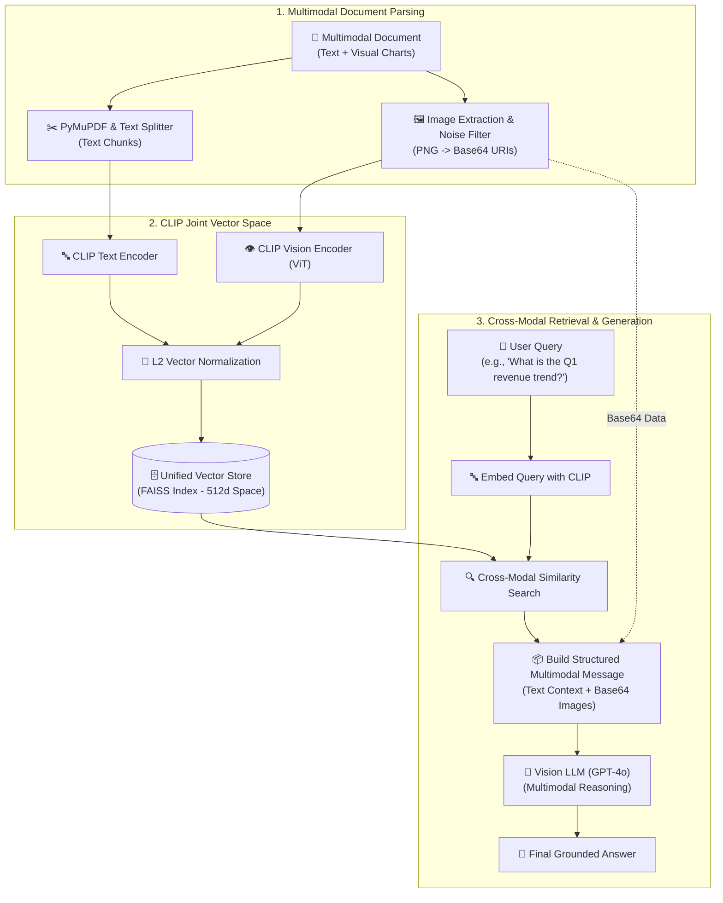

# RAG (Retrieval-Augmented Generation) Comprehensive Notes - Part 2

<details>
<summary><b>LangChain v1.1 Architecture & Modern Agent Concepts (08_langchain_updated_version1.1)</b></summary>

# LangChain v1.1 & LangGraph Agent Architecture

This module contains modern, production-grade implementations and detailed theoretical notes on the **LangChain v1.1 / 1.x API** built on top of the **LangGraph** execution engine.

---

## 📚 Notebook Overview & Core Architecture

| Notebook | Topic & Core Focus | Key LangChain v1.1 APIs Used |
| :--- | :--- | :--- |
| **`1-langchainintro.ipynb`** | Agent Foundations & Graph Engine | `create_agent()`, `@tool`, `agent.invoke()` |
| **`2-modelintegration.ipynb`** | Universal Model Integration, Streaming & Batching | `init_chat_model()`, `ChatOpenAI()`, `ChatGroq()`, `ChatGoogleGenerativeAI()`, `model.stream()`, `model.batch()` |
| **`3-tools.ipynb`** | Tool Definition, Schemas & Execution Loops | `@tool`, `model.bind_tools()`, `ai_msg.tool_calls`, `ToolMessage` |
| **`4-messages.ipynb`** | Canonical Message Schema & Token Tracking | `SystemMessage`, `HumanMessage`, `AIMessage`, `ToolMessage`, `usage_metadata` |
| **`5-structuredoutput.ipynb`** | Enforced Schema Parsing & Validation | `with_structured_output()`, `response_format`, `Pydantic`, `TypedDict`, `@dataclass` |
| **`6-middleware.ipynb`** | Agent Middleware, Memory & Human-in-the-Loop | `SummarizationMiddleware`, `HumanInTheLoopMiddleware`, `InMemorySaver`, `Command` |

---

## 📖 Comprehensive Module Theory & Deep Dives

### 1. `1-langchainintro.ipynb` – Agent Foundations & High-Level Architecture

#### 🧠 Theory & Core Concepts
An **AI Agent** uses a Large Language Model (LLM) as a central reasoning engine to dynamically decide which tools to call, what parameters to extract, and how to sequence actions to satisfy a user request.

- **Legacy vs. LangChain v1.1 Agent Architecture**:
  - *Legacy (`AgentExecutor`)*: Relied on complex Python loops and manual memory state passing.
  - *LangChain v1.1 (`create_agent`)*: Constructs a stateful, compiled graph engine powered by **LangGraph** under the hood. It natively handles cyclic agent loops, message state persistence, and tool execution error recovery.

```python
from langchain.agents import create_agent
from langchain_core.tools import tool

@tool
def get_weather(city: str) -> str:
    # Get the weather for a city
    return f"The weather in {city} is sunny."

agent = create_agent(
    model="gpt-4o-mini",
    tools=[get_weather],
    system_prompt="You are a helpful assistant."
)

# Invocation accepts messages in OpenAI or LangChain format
response = agent.invoke({"messages": [{"role": "user", "content": "What is the weather in New York?"}]})
print(response["messages"])
```

---

### 2. `2-modelintegration.ipynb` – Universal Model Provider Loading, Streaming & Batching

#### 🧠 Theory & Core Concepts
LangChain v1.1 decouples provider-specific code from application logic using a universal model initializer and standardized execution paradigms.

1. **Universal Model Initialization (`init_chat_model`)**:
   Instead of importing provider classes directly (`ChatOpenAI`, `ChatGroq`, `ChatGoogleGenerativeAI`), `init_chat_model()` instantiates any LLM via string identifiers, making provider migration seamless.

   ```python
   from langchain.chat_models import init_chat_model

   model_openai = init_chat_model("gpt-4o-mini")
   model_groq = init_chat_model("groq:llama-3.3-70b-versatile")
   model_gemini = init_chat_model("google_genai:gemini-1.5-flash")
   ```

2. **Streaming Output (`model.stream()`)**:
   - *Concept*: LLMs generate text token by token. Calling `model.stream()` uses HTTP chunked transfer encoding to yield `AIMessageChunk` objects in real time.
   - *UX Benefit*: Eliminates user waiting time by displaying output progressively (reduces Time-To-First-Token).

   ```python
   for chunk in model.stream("Explain quantum computing in 2 sentences"):
       print(chunk.content, end="", flush=True)
   ```

3. **Batch Processing (`model.batch()`)**:
   - *Concept*: Dispatches multiple independent prompts in parallel using async thread pools.
   - *Performance Benefit*: Drastically reduces total latency and increases request throughput compared to sequential `for` loops.

   ```python
   responses = model.batch(["What is 2+2?", "What is 10*5?", "What is 100/4?"])
   ```

---

### 3. `3-tools.ipynb` – Tool Anatomy, Schemas & Both Tool Binding Methods

#### 🧠 Theory & Core Concepts
A **Tool** is a pairing of:
1. **JSON Schema**: Contains the function name, docstring description, and argument parameter types.
2. **Execution Logic**: The underlying Python function or coroutine executed when invoked.

The `@tool` decorator automatically inspects Python type hints (`city: str`) and Google/Sphinx docstrings to auto-generate the JSON schema expected by LLM tool-calling APIs.

#### 🛠️ Both Methods to Add & Bind Tools in LangChain

| Feature | Method 1: `model.bind_tools()` | Method 2: `create_agent(tools=[...])` |
| :--- | :--- | :--- |
| **Execution Loop** | Manual (Developer invokes tool function) | Automatic (LangGraph engine invokes tool function) |
| **Message State** | Manual `ToolMessage` creation & append | Automatic `ToolMessage` state tracking |
| **Control Level** | Fine-grained (Custom UI callbacks, single-step) | High-level (Multi-step autonomous agent execution) |

##### Method 1: Direct Model Binding (`model.bind_tools()`)
```python
from langchain.chat_models import init_chat_model
from langchain_core.tools import tool

@tool
def get_weather(city: str) -> str:
    # Get the weather for a city
    return f"The weather in {city} is sunny."

model = init_chat_model("gpt-4o-mini")
model_with_tools = model.bind_tools([get_weather])

# Generates tool call payload in ai_msg.tool_calls for developer-managed execution
ai_msg = model_with_tools.invoke("What's the weather in Boston?")
print(ai_msg.tool_calls)
# [{'name': 'get_weather', 'args': {'city': 'Boston'}, 'id': 'call_123'}]
```

##### Method 2: Automatic Agent Execution Loop (`create_agent(tools=[...])`)
```python
from langchain.agents import create_agent
from langchain_core.tools import tool

@tool
def get_weather(city: str) -> str:
    # Get the weather for a city
    return f"The weather in {city} is sunny."

# Agent automatically executes the loop: LLM -> Tool Call -> Function Exec -> ToolMessage -> Final Answer
agent = create_agent(
    model="gpt-4o-mini",
    tools=[get_weather],
    system_prompt="You are a helpful assistant."
)
result = agent.invoke({"messages": [{"role": "user", "content": "What's the weather in Boston?"}]})
```

---

### 4. `4-messages.ipynb` – Canonical Message State & Token Usage Metadata

#### 🧠 Theory & Core Concepts
Messages are the fundamental unit of context in LangChain. They represent multi-turn conversation state and carry content, roles, and provider metadata across APIs.

- **Text Prompts vs. Message Prompts**:
  - *Text Prompts*: Standalone strings for simple, single-turn tasks.
  - *Message Prompts*: Structured list of `BaseMessage` objects required for multi-turn chat memory and agent tool-calling loops.

#### 💬 The 4 Canonical Message Types

| Message Class | Role | Purpose & Contents |
| :--- | :--- | :--- |
| **`SystemMessage`** | `system` | Instructions setting persona, tone, rules, and guardrails. |
| **`HumanMessage`** | `user` | User inputs (supports multimodal text, images, audio, files). |
| **`AIMessage`** | `assistant` | Model output (text, reasoning tokens, and `tool_calls` payload). |
| **`ToolMessage`** | `tool` | Output returned by a tool execution, mapped via `tool_call_id`. |

```python
from langchain_core.messages import SystemMessage, HumanMessage, AIMessage, ToolMessage

messages = [
    SystemMessage("You are a helpful financial assistant."),
    HumanMessage("What is the stock price of Apple?"),
    AIMessage(content="", tool_calls=[{"name": "get_stock_price", "args": {"ticker": "AAPL"}, "id": "call_999"}]),
    ToolMessage(content="$225.50", tool_call_id="call_999")
]

response = model.invoke(messages)
print(response.usage_metadata)  # Contains token usage details
```

---

### 5. `5-structuredoutput.ipynb` – Enforced Schema Parsing & Validation

#### 🧠 Theory & Core Concepts
**Structured Output** guarantees that an LLM responds matching a strict schema (JSON/Pydantic), eliminating parsing failures in downstream production code.

#### 📐 Supported Schema Enforcers

1. **Pydantic (`BaseModel`)**: Full runtime field validation, default values, and rich field descriptions (`Field(description=...)`).
2. **TypedDict (`TypedDict`)**: Lightweight Python built-in typing using `Annotated[T, Field(description=...)]`.
3. **Dataclass (`@dataclass`)**: Standard Python data container.

```python
from pydantic import BaseModel, Field
from typing_extensions import TypedDict, Annotated

# Option A: Pydantic Schema
class Movie(BaseModel):
    title: str = Field(description="Title of the movie")
    year: int = Field(description="Release year")

structured_model = model.with_structured_output(Movie)
movie_obj = structured_model.invoke("Provide details about Inception")
# Returns: Movie(title='Inception', year=2010)

# Option B: TypedDict Schema
class MovieDict(TypedDict):
    title: Annotated[str, Field(description="Title of the movie")]
    year: Annotated[int, Field(description="Release year")]

structured_dict_model = model.with_structured_output(MovieDict)
```

- **`include_raw=True`**: Returns a dictionary with `{"raw": AIMessage, "parsed": SchemaObject, "parsing_error": None}` for debugging and tracing raw model tokens.

---

### 6. `6-middleware.ipynb` – Stateful Middleware, Memory Compression & Human-in-the-Loop

#### 🧠 Theory & Core Concepts
**Middleware** intercept and modify internal agent execution steps. They are essential for:
- Logging, analytics, and token cost control.
- Guardrails, PII masking, and output safety filtering.
- Automated memory compression and human approval checkpoints.

#### 1. Summarization Middleware (`SummarizationMiddleware`)
- *Problem*: Long-running multi-turn agent conversations exceed context window limits and consume excessive tokens.
- *Solution*: Automatically compresses older conversation turns into a summarized context block once a message count or token limit is reached, while keeping recent messages intact.

```python
from langchain.agents import create_agent
from langchain.agents.middleware import SummarizationMiddleware
from langgraph.checkpoint.memory import InMemorySaver

agent = create_agent(
    model="gpt-4o-mini",
    checkpointer=InMemorySaver(),
    middleware=[
        SummarizationMiddleware(
            model="gpt-4o-mini",
            trigger=("messages", 10), # Summarize after 10 messages
            keep=("messages", 4)       # Keep latest 4 messages
        )
    ]
)
```

#### 2. Human-In-The-Loop Middleware (`HumanInTheLoopMiddleware`)
- *Problem*: High-stakes tool executions (e.g. database deletes, financial transactions, sending emails) require human oversight before execution.
- *Solution*: Pauses agent execution before executing specified tools. The agent state is persisted using a checkpointer (`InMemorySaver`), and waits for a human approval/rejection/edit signal (`Command`).

```python
from langchain.agents import create_agent
from langchain.agents.middleware import HumanInTheLoopMiddleware
from langgraph.checkpoint.memory import InMemorySaver

agent = create_agent(
    model="gpt-4o-mini",
    tools=[send_email_tool, read_email_tool],
    checkpointer=InMemorySaver(),
    middleware=[
        HumanInTheLoopMiddleware(
            interrupt_before=["send_email_tool"]  # Pause before sending email
        )
    ]
)
```


</details>

---

## 📋 Table of Contents

1. [LangChain v1.1 Architecture (`08_langchain_updated_version1.1`)](#langchain-v11-architecture--modern-agent-concepts-08_langchain_updated_version11)
2. [Multimodal RAG (`07_multimodle RAG`)](#13-multimodal-rag-07_multimodle-rag)
    * [Multimodal RAG with OpenAI (GPT-4o) & CLIP Joint Embeddings (`1-multimodalopenai.ipynb`)](#131-multimodal-rag-with-openai-gpt-4o--clip-joint-embeddings-1-multimodalopenaiipynb)

---

## 13. Multimodal RAG (`07_multimodle RAG`)

### 13.1 Multimodal RAG with OpenAI (GPT-4o) & CLIP Joint Embeddings (`1-multimodalopenai.ipynb`)

#### 🎯 Why We Need This:
Standard RAG systems rely exclusively on text extraction loaders. However, real-world enterprise documents—such as financial reports, medical charts, technical manuals, architectural designs, and slide decks—contain critical information in visual elements (charts, plots, diagrams, flowcharts, tables, and photos).
- **Text-Only RAG Limitations**: Text splitters skip or mangle visual charts, losing trend data and quantitative relationships.
- **Multimodal RAG Solution**: Combines <mark style="background-color: #d4edda; color: #155724; padding: 2px 4px; border-radius: 4px;">Joint Embedding Space (CLIP)</mark> with <mark style="background-color: #d4edda; color: #155724; padding: 2px 4px; border-radius: 4px;">Vision LLMs (GPT-4o)</mark>.
  - **Shared Vector Space**: Both text passages and image pixels are embedded into the exact same 512-dimensional vector space. A natural language text query (e.g., *"Show Q1 revenue trend chart"*) directly matches image embeddings in a vector database.
  - **Multimodal Prompt Reasoning**: Retrieved text chunks and base64-encoded visual images are assembled into a structured prompt for **GPT-4o**, enabling holistic visual-textual reasoning.

#### 📊 Multimodal AI Architecture Diagram:


---

### Imports
```python
import os
import io
import base64
import numpy as np
import torch
from PIL import Image, ImageDraw
import pymupdf  # PyMuPDF
from dotenv import load_dotenv

# HuggingFace Transformers for CLIP
from transformers import CLIPProcessor, CLIPModel

# LangChain Core & Integration Libraries
from langchain_core.documents import Document
from langchain_core.messages import HumanMessage
from langchain_core.embeddings import Embeddings
from langchain_text_splitters import RecursiveCharacterTextSplitter
from langchain_community.vectorstores import FAISS
from langchain_openai import ChatOpenAI
```

<details>
<summary><b>🧠 Deep Dive: How CLIP Joint Embedding Space & Vector Normalization Work</b></summary>

### How CLIP Enables Cross-Modal Search
OpenAI's CLIP (`openai/clip-vit-base-patch32`) consists of two parallel encoders:
1. **Text Encoder**: Maps text tokens into a 512-dimensional embedding vector \(\mathbf{v}_{text}\).
2. **Image Encoder (Vision Transformer / ViT)**: Maps raw image pixels into a 512-dimensional embedding vector \(\mathbf{v}_{image}\).

Both encoders are contrastively trained on hundreds of millions of image-caption pairs so that text descriptions and corresponding visual images align tightly in the same vector space:

$$\text{Cosine Similarity}(\mathbf{v}_{text}, \mathbf{v}_{image}) = \frac{\mathbf{v}_{text} \cdot \mathbf{v}_{image}}{\|\mathbf{v}_{text}\|_2 \|\mathbf{v}_{image}\|_2}$$

### L2 Vector Normalization Rule
Before storing vectors in FAISS or computing dot products, vectors MUST be L2-normalized to unit magnitude:

$$\hat{\mathbf{v}} = \frac{\mathbf{v}}{\sqrt{\sum_{i=1}^{d} v_i^2}}$$

When vectors are normalized (\(\|\hat{\mathbf{v}}\|_2 = 1\)), Inner Product (dot product) equals Cosine Similarity, enabling high-speed vector similarity search.

### Robust HuggingFace `transformers` Output Extraction
Depending on the version of `transformers`, `CLIPModel.get_text_features()` or `get_image_features()` may return a tensor, a `CLIPOutput`, or a `BaseModelOutputWithPooling` object. Robust code extracts the tensor explicitly:

```python
features = clip_model.get_text_features(**inputs)
if hasattr(features, "pooler_output"):
    features = features.pooler_output
elif hasattr(features, "text_embeds"):
    features = features.text_embeds
elif isinstance(features, (tuple, list)):
    features = features[0]

# Normalize to unit vector
features = features / features.norm(dim=-1, keepdim=True)
```
</details>

<details>
<summary><b>💡 Helper Pattern: Programmatically Generating Synthetic Multimodal Sample PDFs</b></summary>

When developing and testing multimodal RAG pipelines without requiring external sample downloads, you can programmatically generate a synthetic PDF containing both text and visual image charts using PyMuPDF (`pymupdf`) and `Pillow`:

```python
def ensure_sample_pdf(pdf_path="multimodal_sample.pdf"):
    if os.path.exists(pdf_path):
        return pdf_path
    
    doc = pymupdf.open()
    page = doc.new_page()
    
    # 1. Add text elements
    page.insert_text((50, 50), "Sample Multimodal PDF Document", fontsize=18)
    page.insert_text((50, 80), "This document contains text descriptions and visual chart images.", fontsize=12)
    page.insert_text((50, 110), "Company Revenue for Q1 reached $10M with strong growth in cloud services.", fontsize=11)
    
    # 2. Draw visual chart image using PIL
    img = Image.new('RGB', (300, 150), color=(240, 240, 240))
    d = ImageDraw.Draw(img)
    d.rectangle([30, 30, 270, 120], outline=(0, 0, 255), width=2)
    d.text((40, 40), "Q1 Revenue Chart: $10M", fill=(0, 0, 0))
    d.line([(50, 100), (100, 80), (150, 90), (200, 50), (250, 40)], fill=(255, 0, 0), width=3)
    
    # 3. Stream image bytes to PDF page
    img_bytes = io.BytesIO()
    img.save(img_bytes, format='PNG')
    page.insert_image(pymupdf.Rect(50, 150, 350, 300), stream=img_bytes.getvalue())
    
    doc.save(pdf_path)
    doc.close()
    return pdf_path
```
*   **Why use this?** Guarantees that unit tests and demonstration notebooks remain 100% self-contained and reproducible across any environment.
</details>

<details>
<summary><b>🖼️ OpenAI Vision API Multimodal Message Payload & Detail Level Rules</b></summary>

OpenAI's Vision API (used by `gpt-4o` and `gpt-4o-mini`) accepts multi-part structured `HumanMessage` content payloads combining string blocks and Data URI image blocks:

```python
HumanMessage(content=[
    {
        "type": "text", 
        "text": "Question: What does the chart show about revenue trends?"
    },
    {
        "type": "text", 
        "text": "Context Excerpts:\n[Page 0]: Revenue reached $10M in Q1."
    },
    {
        "type": "image_url",
        "image_url": {
            "url": "data:image/png;base64,iVBORw0KGgoAAAANSUhEUgAA...",
            "detail": "auto"  # Options: 'auto', 'low', 'high'
        }
    }
])
```

### Vision Detail Parameter Settings
- `detail: "low"`: Converts image to a fixed 512x512 low-res tile (<mark style="background-color: #d4edda; color: #155724; padding: 2px 4px; border-radius: 4px;">85 tokens per image</mark>). Fast & cheap for simple layouts or logos.
- `detail: "high"`: Crops & processes high-resolution 512px tiles (<mark style="background-color: #fff3cd; color: #856404; padding: 2px 4px; border-radius: 4px;">170 tokens per tile + 85 base tokens</mark>). Best for reading small diagram labels and intricate chart numbers.
- `detail: "auto"`: Model dynamically selects low or high detail based on image resolution (<mark style="background-color: #d4edda; color: #155724; padding: 2px 4px; border-radius: 4px;">Recommended default</mark>).
</details>

---

### How to Use

#### 1. Initializing CLIP & Custom Embeddings Wrapper
```python
# Load CLIP model and processor
device = "cuda" if torch.cuda.is_available() else "cpu"
clip_model = CLIPModel.from_pretrained("openai/clip-vit-base-patch32").to(device)
clip_processor = CLIPProcessor.from_pretrained("openai/clip-vit-base-patch32")
clip_model.eval()

class CLIPEmbeddings(Embeddings):
    """Custom Embeddings wrapper implementing LangChain's Embeddings interface for CLIP."""
    def __init__(self, model, processor, device=device):
        self.model = model
        self.processor = processor
        self.device = device

    def embed_text(self, text: str) -> np.ndarray:
        inputs = self.processor(text=text, return_tensors="pt", padding=True, truncation=True, max_length=77).to(self.device)
        with torch.no_grad():
            features = self.model.get_text_features(**inputs)
            if hasattr(features, "pooler_output"):
                features = features.pooler_output
            elif hasattr(features, "text_embeds"):
                features = features.text_embeds
            elif isinstance(features, (tuple, list)):
                features = features[0]
            features = features / features.norm(dim=-1, keepdim=True)
            return features.squeeze(0).cpu().numpy().astype(np.float32)

    def embed_image(self, image_input) -> np.ndarray:
        image = Image.open(image_input).convert("RGB") if isinstance(image_input, str) else image_input.convert("RGB")
        inputs = self.processor(images=image, return_tensors="pt").to(self.device)
        with torch.no_grad():
            features = self.model.get_image_features(**inputs)
            if hasattr(features, "pooler_output"):
                features = features.pooler_output
            elif hasattr(features, "image_embeds"):
                features = features.image_embeds
            elif isinstance(features, (tuple, list)):
                features = features[0]
            features = features / features.norm(dim=-1, keepdim=True)
            return features.squeeze(0).cpu().numpy().astype(np.float32)

    def embed_documents(self, texts: list[str]) -> list[list[float]]:
        return [self.embed_text(t).tolist() for t in texts]

    def embed_query(self, text: str) -> list[float]:
        return self.embed_text(text).tolist()

clip_embedder = CLIPEmbeddings(clip_model, clip_processor)
```

#### 2. Parsing PDF Text & Extracting Filtered Images (`PyMuPDF`)

##### 🚀 Modern Simplified Method (Recommended)
```python
# Open PDF document
doc = pymupdf.open("multimodal_sample.pdf")

all_docs = []
all_embeddings = []
image_data_store = {}

splitter = RecursiveCharacterTextSplitter(chunk_size=500, chunk_overlap=100)

for i, page in enumerate(doc):
    # 1. Process text content (simplified via create_documents)
    text = page.get_text()
    if text.strip():
        text_chunks = splitter.create_documents(
            texts=[text], 
            metadatas=[{"page": i, "type": "text"}]
        )
        all_docs.extend(text_chunks)
        all_embeddings.extend([clip_embedder.embed_text(c.page_content) for c in text_chunks])

    # 2. Extract visual image elements
    for img_idx, img in enumerate(page.get_images(full=True)):
        try:
            xref = img[0]
            base_img = doc.extract_image(xref)
            image_bytes = base_img["image"]
            
            # Convert to PIL Image for dimension filtering & embedding
            pil_img = Image.open(io.BytesIO(image_bytes)).convert("RGB")
            
            # 🔹 RULE OF THUMB: Filter graphic noise (icons, bullet dots, lines)
            if pil_img.width < 50 or pil_img.height < 50:
                continue
                
            img_id = f"page_{i}_img_{img_idx}"
            
            # Store base64 directly from extracted PDF image bytes (no re-encoding needed!)
            image_data_store[img_id] = base64.b64encode(image_bytes).decode()
            
            # Compute CLIP embedding for image & store document
            all_embeddings.append(clip_embedder.embed_image(pil_img))
            all_docs.append(Document(
                page_content=f"[Image: {img_id}]",
                metadata={"page": i, "type": "image", "image_id": img_id}
            ))
        except Exception as e:
            print(f"Error processing image {img_idx} on page {i}: {e}")

doc.close()
```

<details>
<summary><b>Older Method: Manual Document Creation & Buffer Re-encoding</b></summary>

```python
# Open PDF document
doc = pymupdf.open("multimodal_sample.pdf")

all_docs = []
all_embeddings = []
image_data_store = {}

splitter = RecursiveCharacterTextSplitter(chunk_size=500, chunk_overlap=100)

for i, page in enumerate(doc):
    # 1. Process text content
    text = page.get_text()
    if text.strip():
        temp_doc = Document(page_content=text, metadata={"page": i, "type": "text"})
        chunks = splitter.split_documents([temp_doc])
        for chunk in chunks:
            all_embeddings.append(clip_embedder.embed_text(chunk.page_content))
            all_docs.append(chunk)

    # 2. Extract visual image elements
    for img_idx, img in enumerate(page.get_images(full=True)):
        try:
            xref = img[0]
            base_img = doc.extract_image(xref)
            pil_img = Image.open(io.BytesIO(base_img["image"])).convert("RGB")
            
            # 🔹 RULE OF THUMB: Filter graphic noise (icons, bullet dots, lines)
            if pil_img.width < 50 or pil_img.height < 50:
                continue
                
            img_id = f"page_{i}_img_{img_idx}"
            
            # Store base64 data URI in memory for Vision LLM
            buf = io.BytesIO()
            pil_img.save(buf, format="PNG")
            image_data_store[img_id] = base64.b64encode(buf.getvalue()).decode()
            
            # Compute CLIP embedding for image
            all_embeddings.append(clip_embedder.embed_image(pil_img))
            all_docs.append(Document(
                page_content=f"[Image: {img_id}]",
                metadata={"page": i, "type": "image", "image_id": img_id}
            ))
        except Exception as e:
            print(f"Error processing image {img_idx} on page {i}: {e}")

doc.close()
```
</details>

#### 3. Building Unified Vector Store (`FAISS`)
```python
# Convert embeddings to numpy array
embeddings_array = np.array(all_embeddings, dtype=np.float32)
text_embedding_pairs = [(doc.page_content, emb) for doc, emb in zip(all_docs, embeddings_array)]

# Build FAISS vector store with precomputed CLIP embeddings
vector_store = FAISS.from_embeddings(
    text_embeddings=text_embedding_pairs,
    embedding=clip_embedder,
    metadatas=[doc.metadata for doc in all_docs]
)
```

#### 4. Multimodal Retrieval & Vision LLM Synthesis (`GPT-4o`)
```python
# Initialize ChatOpenAI model (with dry-run key fallback)
openai_key = os.getenv("OPENAI_API_KEY", "sk-placeholder-key-for-dry-run")
llm = ChatOpenAI(model="gpt-4o", temperature=0, api_key=openai_key)

def retrieve_multimodal(query: str, k: int = 5):
    """Search unified vector space using text query CLIP embedding."""
    query_emb = clip_embedder.embed_text(query)
    return vector_store.similarity_search_by_vector(embedding=query_emb, k=k)

def create_multimodal_message(query: str, retrieved_docs: list[Document]) -> HumanMessage:
    """Construct structured HumanMessage with text excerpts and inline base64 images."""
    content = [{"type": "text", "text": f"Question: {query}\n\nContext:\n"}]
    
    text_docs = [d for d in retrieved_docs if d.metadata.get("type") == "text"]
    image_docs = [d for d in retrieved_docs if d.metadata.get("type") == "image"]
    
    if text_docs:
        context_str = "\n\n".join([f"[Page {d.metadata['page']}]: {d.page_content}" for d in text_docs])
        content.append({"type": "text", "text": f"Text Excerpts:\n{context_str}\n"})
        
    for d in image_docs:
        img_id = d.metadata.get("image_id")
        if img_id and img_id in image_data_store:
            content.append({"type": "text", "text": f"\n[Image from page {d.metadata['page']}]:\n"})
            content.append({
                "type": "image_url",
                "image_url": {
                    "url": f"data:image/png;base64,{image_data_store[img_id]}",
                    "detail": "auto"
                }
            })
            
    content.append({"type": "text", "text": "\n\nPlease answer the question based on the provided text and images."})
    return HumanMessage(content=content)

def multimodal_pdf_rag_pipeline(query: str):
    retrieved = retrieve_multimodal(query, k=5)
    message = create_multimodal_message(query, retrieved)
    
    real_key = os.getenv("OPENAI_API_KEY")
    if not real_key or real_key.startswith("sk-placeholder"):
        print("Note: OPENAI_API_KEY is missing. Skipping LLM invocation.")
        return "[Dry-run complete: OpenAI API key required for full answer generation]"
        
    response = llm.invoke([message])
    return response.content

# Execute query
response_text = multimodal_pdf_rag_pipeline("What does the revenue trend chart show?")
print(response_text)
```

---

### What They Do
*   `CLIPModel` & `CLIPProcessor` (`openai/clip-vit-base-patch32`): Multi-modal neural network that projects text strings and image pixels into the **same shared 512-dimensional vector space**, enabling cross-modal text-to-image similarity search.
*   `CLIPEmbeddings`: Custom subclass of `langchain_core.embeddings.Embeddings`. Wraps CLIP text and image encoding methods into LangChain standard `embed_documents` and `embed_query` contracts.
*   `PyMuPDF` (`pymupdf`): C-accelerated PDF parser. Performs rapid page text extraction and binary image stream extraction (`doc.extract_image`).
*   `Image Dimension Filter`: <mark style="background-color: #d4edda; color: #155724; padding: 2px 4px; border-radius: 4px;">Crucial pre-processing step</mark>. Discards images with `width < 50` or `height < 50` pixels to eliminate bullet points, lines, background fills, and UI icons from polluting vector search.
*   `FAISS.from_embeddings`: Vector database index initialized with pre-computed text and image embedding tuples `(content, embedding_vector)` alongside custom metadata.
*   `ChatOpenAI(model="gpt-4o")`: OpenAI's flagship multimodal model capable of reading and reasoning over both text strings and high-resolution images.
*   `HumanMessage(content=[...])`: Structured multi-part message object carrying text prompts (`"type": "text"`) and inline base64 image objects (`"type": "image_url"`).

---

### 💡 Advanced Best Practices & Key Insights:
*   **Cross-Modal Retrieval Efficiency**: Because CLIP places text and image vectors in the exact same space, a user query like *"revenue graph"* directly retrieves the corresponding image document vector even if no OCR text was extracted from that image.
*   **Image Format & RGB Conversion**: Always convert extracted PDF image bytes using `.convert("RGB")`. PDFs often store images in CMYK, RGBA, or indexed palette formats that crash PyTorch or OpenAI vision models if not converted to standard RGB PNG/JPEG.
*   **Base64 Memory Management**: Store base64 data strings in an in-memory key-value dictionary (`image_data_store`) or cloud object storage (S3/GCS) indexed by `image_id` (`page_X_img_Y`). Avoid dumping thousands of temporary image files onto local disk.
*   **Token Cost & Detail Level Optimization**: Always set `"detail": "auto"` (or `"low"` for high-volume pipelines) on `image_url` dictionary objects to prevent excessive vision token consumption on simple diagrams.
